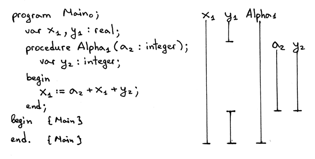

This is what we're going to learn today:

1. Scopes, why scopes useful, how to implement them in code with symbol tables

1. Nested scopes, how chained scoped symbol tables are used to implement nested scopes

1. How to parse procedure declarations with formal parameters and how to represent a procedure symbol in code.

1. How to extend the *semantic analyzer* to do semantic checks in the presence of nested scopes

1. Learn more about *name resolution* and how the semantic analyzer resolves names to their declarations when a program has nested scopes.

1. How to build a *scope tree*.

1. How to write the very own *source-to-source compiler* 

## Scopes and scoped symbol tables

A *scope* is a textual region of a program where a name can be used.

```
program Main;
    var x, y : integer;
begin
    x := x + y;
end.
```

In Pascal, the *PROGRAM* keyword (case insensitive) introduces a new scope which is commonly called a *global scope*, so the program above has one *global scope* and the declared variables x and y are visible and accessible in the whole program.

When we talk about the scope of a variable, we actually talk about the scope of its declaration.

Pascal programs are said to be *lexically scoped* (or *statically scoped*) because you can look at the source code, and without even executing the program, determine purely based on the textual rules which names(references) resolve or refer to which declarations. In Pascal, lexcial keywords like *program* and *end* demarcate the textual boundaries of a scope:


Why are scopes useful?

- Every scope creates an isolated namespace, which means that variables declared in a scope cannot be accessed from outside of it.

- Re-use the same name in different scopes and know exactly, just by looking at the program source code, what declaration the name refers to at every point in the program.

- In a nested scope you can re-declare a variable with the same name as in the outer scope, thus effectively hiding the outer declaration, which gives you control over access to different variables from the outer scope.

In addition to the *global scope*, Pascal supports nested procedures, and every procedure declaration introduces a new scope, which means that Pascal supports nested scopes.

When we talk about nested scopes, it's convenient to talk about scope levels to show their nesting relationships. It's also convenient to refer to scopes by name. We'll use both scope levels and scope names when we start our discussion of nested scopes.

Let's take a look at the following sample program and subscript every name in the program to make it clear:

1. At what level each variable (symbol) is declared
2. To which declaration and at what level a variable name refers to:


From the picture above we can see several things:

- We have a single scope, the *global* scope, introduced by the PROGRAM keyword
- Global *scope* is at level 1
- Variables (symbols) x and y are declared at level 1 (the *global* scope).
- *integer* built-in type is also declared at level 1
- The program name Main has a subscript 0. Why is the program's name at level zero, you might wonder? This is to make it clear that the program's name is not in the *global scope* and it's in some other outer scope, that has level zero.
- The scope of the variables x and y is the whole program, as shown by the vertical lines
- The *scope information table* shows for every level in the program the corresponding scope level, scope name, and names declared in the scope. The purpose of the table is to summarize and visually show different information about scopes in a program.

To represent a scope in code, we'll need a *scoped symbol table*, which is basically a symbol table with a few modifications.

From now on, we'll use the word *scope* both to mean the concept of a scope as well as to refer to the scoped symbol table which is an implementation of the scope in code.

Even though in our code a scope is represented by an instance of the *ScopedSymbolTable* class, we'll use the variable named *scope* throughout the code for convenience. So when you see a variable *scope* in the code of the interpreter, you should know that it actually refers to a *scoped symbol table*.

Now, let's enhance our *SymbolTable* class by renaming it to *ScopedSymbolTable* class, adding two new fields *scope_level* and *scope_name*, and updating the scoped symbol table's constructor. And at the same time, let's update the `__str__` method to print additional information, namely the *scope_level* and *scope_name*.

```python
class ScopedSymbolTable(object):
    def __init__(self, scope_name, scope_level):
        self._symbols = OrderedDict()
        self.scope_name = scope_name
        self.scope_level = scope_level
        self._init_builtins()

    def _init_builtins(self):
        self.insert(BuiltinTypesSymbol('INTEGER'))
        self.insert(BuiltinTypesSymbol('REAL'))
    
    def __str__(self):
        h1 = 'SCOPE (SCOPED SYMBOL TABLE)'
        lines = ['\n', h1, '=' * len(h1)]
        for header_name, header_value in (
            ('Scope name' , self.scope_name),
            ('Scope level', self.scope_level)
        ):
            lines.append('%-15s: %s' % (header_name, header_value))
        
        h2 = 'Scope (Scoped symbol table) contents'
        lines.extend([h2, '-' *len(h2)])
        lines.extend(
            ('%7s: %r ' % (key , value)) for key ,value in self._symbols.items()
        )
        lines.append('\n')
        s = '\n'.join(lines)
        return s

    __repr__ = __str__ 

    def insert(self, symbol):
        print('Insert: %s' % symbol.name)
        self._symbols[symbol.name] = symbol

    def lookup(self, name):
        print('Lookup: %s' % name)
        symbol = self._symbols.get(name)
        # 'symbol' is either an instance of the Symbol class or None
        return symbol
```

We need to update the semantic analyzer to use the variable *scope* instead of *symtab*, and remove the semantic check that was checking source programs for duplicate identifiers from the *visit_VarDecl* method to reduce the noise in the program output.

```python
class SemanticAnalyzer(NodeVisitor):
    def __init__(self):
        self.scope = ScopedSymbolTable(scope_name='global', scope_level=1)

    ...
```

## Procedure declarations with formal parameters

A sample code that contains a procedure declaration:

```
program Main;
   var x, y: real;

   procedure Alpha(a : integer);
      var y : integer;
   begin
      x := a + x + y;
   end;

begin { Main }

end.  { Main }
```

You can see the procedure here comes with a parameter. Let's tackle this first by making a quick detour and learning how to handle formal procedure parameters.

>
> ASIDE
> *Formal parameters* are parameters that show up in the declaration of a procedure.
> *Arguments* (aka *actual parameters*) are different variables and expressions passed to a procedure in a particular procedure call.
>

We have many changes to make to support procedure declarations with parameters:

1. Add the *Param AST* node

    ```python
    class Param(AST):
        def __init__(self, var_node, type_node):
            self.var_node = var_node
            self.type_node = type_node
    ```

1. Update the *ProcedureDecl* node's constructor to take an additional argument: *params*

    ```python
    class ProcedureDecl(AST):
        def __init__(self, proc_name, params, block_node):
            self.proc_name = proc_name
            self.params = params  # a list of Param nodes
            self.block_node = block_node
    ```

1. Update the *declarations* rule to reflect changes in the procedure declaration sub-rule

    ```python
    def declarations(self):
        """declarations : (VAR (variable_declaration SEMI)+)*
                    | (PROCEDURE ID (LPAREN formal_parameter_list RPAREN)? SEMI block SEMI)*
                    | empty
        """
    ```

1. The *formal_parameter_list* rule and method

    ```python
    def formal_parameter_list(self):
        """ formal_parameter_list : formal_parameters
                                | formal_parameters SEMI formal_parameter_list
        """
    ```

1. Add the *formal_parameters* rule and method

    ```python
    def formal_parameters(self):
        """ formal_parameters : ID (COMMA ID)* COLON type_spec """
        param_nodes = []
    ```

With these addition of the above methods and rules our parser will be able to parse procedure declarations like the following sample code:

```
procedure Foo;

procedure Foo(a : INTEGER);

procedure Foo(a, b : INTEGER);

procedure Foo(a, b : INTEGER; c : REAL);
```

||
|:-:|
|AST|

## Procedure Symbols

As with variable declarations, and built-in type declarations, there is a separate category of symbols for procedures. Let's create a separate symbol class for procedure symbols:

```python
class ProcedureSymbol(Symbol):
    def __init__(self, name, params=None):
        super().__init__(name)
        # a list of formal parameters
        self.params = params if params is not None else []
    
    def __str__(self):
        return '<{class_name}(name={name}, parameters={params})>'.format(
            class_name=self.__class__.__name__,
            name=self.name,
            params=self.params,
        )

    __repr__ = __str__
```
Procedure symbols have a name (the procedure's name), their category is procedure (encoded in the class name), and the type is *None* because in Pascal procedures don't return anything.

Procedure symbols also carry additional information about procedure declarations, namely they contain informaiton about the procedure's formal parameters.

With the addition of procedure symbols, our new symbol hierarchy looks like this:


## Nested Scopes

Now time to get back to the program and the discussion of nested scopes:

```
program Main;
   var x, y: real;

   procedure Alpha(a : integer);
      var y : integer;
   begin
      x := a + x + y;
   end;

begin { Main }

end.  { Main }
```

By declaring a new procedure, we introduce a new scope, and this scope is nested within the *global scope* introduced by the *PROGRAM* statement, so this is a case where we have nested scopes in a Pascal program.

The scope of a procedure is the whole body of the procedure. The beginning of the procedure scope is marked by the *PROCEDURE* keyword and the end is marked by the *END* keyword and a semicolon.

Let's subscript names in the program and show some additional information:



Some observation from the picture above:

- Tow scope level: level 1 and level 2

- The *nesting relationships* diagram visually shows that the scope *Alpha* is nested within the *global scope*, hence there are two levels: the *global scope* at level 1, and the *Alpha* scope at level 2.

- The scope level of the procedure declaration *Alpha* is one less than the level of the variables declared inside the procedure *Alpha*. 

- The variable declaration of y inside *Alpha* hides the declaration of y in the *global scope*. You can see the hole in the vertical bar for y<sub>1</sub> and you can see that the scope of the y<sub>2</sub> variable declaration is the Alpha procedure's whole body.

- The scope information table shows scope levels, scope names for those levels, and respective names declared in those scopes.

- In the picture, we omitted showing the scope of the *integer* and *real* types (except in the scope information table) because they are always declared at scope level 1, the *global scope*.

Now on discussing implementation details.

First, let's focus on variable and procedure declarations. Then, we'll discuss variable references and how *name resolution* works in teh presence of nested scopes.

For our discussion, we'll use a stripped down version of the program. The following version does not have variable references, it only has variable and procedure declarations:

```
program Main;
   var x, y: real;

   procedure Alpha(a : integer);
      var y : integer;
   begin

   end;

begin { Main }

end.  { Main }
```

From the code, we have two scopes: the *global scope* and the scope introduced by the procedure *Alpha*. Following our approach we should now have two scoped symbol tables: one for the *global scope* and one for the *Alpha scope*.

We'll extend the semantic analyzer to create a separate scoped symbol table for every scope instead of just for the *global scope*. The scope construction will happen when walking the AST.

We're going to update the *visit_Program* method and add the *visit_ProcedureDecl* method to create scoped symbol tables. 

```python
def visit_Program(self,node):
    print('ENTER scope: global')
    global_scope = ScopedSymbolTable(
        scope_name='global',
        scope_level=1
    )
    self.current_scope = global_scope

    # visit subtree
    self.visit(node.block)

    print(global_scope)
    print('LEAVE scope: global')
```

The method has quite a few changes:

1. When visiting the node in AST, we first print what scope we're entering, in this case *global*.

1. Create a separate *scoped symbol table* to represent the *global scope*. When constructing an instance of *ScopedSymbolTable*, we explicitly pass the scope name and scope level arguments to the class constructor.

1. Assign the newly created scope to the instance variable *current_scope*. Other visitor methods that insert and look up symbols in scoped symbol tables will use the *current_scope*.

1. Visit a subtree (block). 

1. Before leaving the *global scope* we print the contents of the *global scope* (scoped symbol table)

1. Print the message when leaving the global scope

Now let's add the *visit_ProcedureDecl* method:

```python
def visit_ProcedureDecl(self, node):
    proc_name = node.proc_name
    proc_symbol = ProcedureSymbol(proc_name)
    self.current_scope.insert(proc_symbol)

    print('ENTER scope: %s ' % proc_name)

    # Scope for parameters and Local variables
    procedure_scope = ScopedSymbolTable(
        scope_name=proc_name,
        scope_level=2
    )
    self.current_scope = procedure_scope

    # Insert parameters into the procedure scope
    for param in node.params:
        param_type = self.current_scope.lookup(param.type_node.value)
        param_name = param.var_node.value
        var_symbol = VarSymbol(param_name, param_type)
        self.current_scope.insert(var_symbol)
        proc_symbol.params.append(var_symbol)
    
    self.visit(node.block_node)

    print(procedure_scope)
    print('LEAVE scope: %s' %s proc_name)
```

Let's go over the contents of the method:

1. The first thing that the method does is create a procedure symbol and insert it into the current scope, which is the *global* scope for our sample program.

1. Prints the message about entering the procedure scope.

1. Then create a new scope for the procedure's parameters and variable declarations.

1. Assign the procedure scope to the *self.current_scope* variable indicating that this is our current scope and all symbol operations (*insert* and *lookup*) will use the current scope.

1. Then handle procedure formal parameters by inserting them into the current scope and adding them to the procedure symbol.

1. Then visit the rest of the AST subtree - the body of the procedure.

1. Finally, print the message about leaving the scope before leaving the node and moving to another AST node, if any.

Now, what we need to do is update other semantic analyzer visitor methods to use *self.current_scope* when inserting and looking up symbols

```python
def visit_VarDecl(self, node):
    type_name = node.type_node.value
    type_symbol = self.current_scope.lookup(type_name)

    # We have all the information we need to create a variable symbol.
    # Create the symbol and insert it into the symbol table.
    var_name = node.var_node.value
    var_symbol = VarSymbol(var_name, type_symbol)

    self.current_scope.insert(var_symbol)

def visit_Var(self, node):
    var_name = node.value    
    var_symbol = self.current_scope.lookup(var_name)
    if var_symbol is None:
        raise Exception(
            "Error: Symbol(identifier) not found '%s' " % var_name
        )
```

Both the *visit_VarDeal* and *visit_Var* will now use the *current_scope* to insert and/or look up symbols.

We also need to update the semantic analyzer and set the *current_scope* to *None* in the constructor:

```python
class SemanticAnalyzer(NodeVisitor):
    def __init__(self):
        self.current_scope = None
    
    def visit_Block(self, node):
        for declaration in node.declarations:
            self.visit(declaration)
        self.visit(node.compound_statement)

    def visit_Program(self, node):
        print('ENTER scope: global')
        global_scope = ScopedSymbolTable(
            scope_name='global',
            scope_level=1,
        )
        self.current_scope = global_scope

        # visit subtree
        self.visit(node.block)

        print(global_scope)
        print('LEAVE scope: global')

    def visit_Compound(self, node):
        for child in node.children:
            self.visit(child)

    def visit_NoOp(self, node):
        pass

    def visit_BinOp(self, node):
        self.visit(node.left)
        self.visit(node.right)

    def visit_ProcedureDecl(self, node):
        proc_name = node.proc_name
        proc_symbol = ProcedureSymbol(proc_name)
        self.current_scope.insert(proc_symbol)

        print('ENTER scope: %s' %  proc_name)
        # Scope for parameters and local variables
        procedure_scope = ScopedSymbolTable(
            scope_name=proc_name,
            scope_level=2,
        )
        self.current_scope = procedure_scope

        # Insert parameters into the procedure scope
        for param in node.params:
            param_type = self.current_scope.lookup(param.type_node.value)
            param_name = param.var_node.value
            var_symbol = VarSymbol(param_name, param_type)
            self.current_scope.insert(var_symbol)
            proc_symbol.params.append(var_symbol)

        self.visit(node.block_node)

        print(procedure_scope)
        print('LEAVE scope: %s' %  proc_name)

    def visit_VarDecl(self, node):
        type_name = node.type_node.value
        type_symbol = self.current_scope.lookup(type_name)

        # We have all the information we need to create a variable symbol.
        # Create the symbol and insert it into the symbol table.
        var_name = node.var_node.value
        var_symbol = VarSymbol(var_name, type_symbol)

        self.current_scope.insert(var_symbol)

    def visit_Assign(self, node):
        # right-hand side
        self.visit(node.right)
        # left-hand side
        self.visit(node.left)

    def visit_Var(self, node):
        var_name = node.value
        var_symbol = self.current_scope.lookup(var_name)
        if var_symbol is None:
            raise Exception(
                "Error: Symbol(identifier) not found '%s'" % var_name
            )
```

## Scope tree: Chaining scoped symbol tables

Now every scope is represented by a separate scoped symbol table, how do we express in code that the scope *B* is nested within the *global scope*?

Chain the tables together.

Let's take a look at the following *scope tree*:


So how to do that?

1. Update the *ScopedSymbolTable* class and add  a variable *enclosing_scope* that will hold a pointer to the scope's enclosing scope.

1. Upadte the *visit_Program* and *visit_ProcedureDecl* methods to create an actual link to the scope's enclosing scope using the updated version of the *ScopedSymbolTable* class.

```python
class ScopedSymbolTable(object):
    def __init__(self, scoped_name, scope_level, enclosing_scope=None):
        self._symbols = OrderedDict()
        self.scope_name = scope_name
        self.scope_level = scope_level
        self.enclosing_scope = enclosing_scope
        self._init_builtins()
    
    def _init_builtins(self):
        self.insert(BuiltinTypeSymbol('INTEGER'))
        self.insert(BuiltinTypeSymbol('REAL'))

    def __str__(self):
        h1 = 'SCOPE (SCOPED SYMBOL TABLE)'
        lines = ['\n', h1, '=' * len(h1)]
        for header_name, header_value in (
            ('Scope name', self.scope_name),
            ('Scope level', self.scope_level),
            ('Enclosing scope',
             self.enclosing_scope.scope_name if self.enclosing_scope else None
            )
        ):
            lines.append('%-15s: %s' % (header_name, header_value))
        h2 = 'Scope (Scoped symbol table) contents'
        lines.extend([h2, '-' * len(h2)])
        lines.extend(
            ('%7s: %r' % (key, value))
            for key, value in self._symbols.items()
        )
        lines.append('\n')
        s = '\n'.join(lines)
        return s

    __repr__ = __str__

    def insert(self, symbol):
        print('Insert: %s ' % symbol.name)
        self._symbol[symbol.name] = symbol

    def lookup(self, name):
        print('Lookup: %s ' % name)    
        symbol = self._symbols.get(name)
        # 'symbol' is either an instance of the Symbol or None
        return symbol

def visit_Program(self, node):
    print('ENTER scope: global')
    global_scope = ScopedSymbolTable(
        scope_name='global',
        scope_level=1,
        enclosing_scope=self.current_scope, # None
    )
    self.current_scope = global_scope

    # visit subtree
    self.visit(node.block)

    print(global_scope)

    self.current_scope = self.current_scope.enclosing_scope
    print('LEAVE scope: global')
```

There are a couple of things worth mentioning and repeating:

1. Explicitly pass the *self.current_scope* as the *enclosing_scope* argument when creating a scope

1. Assign the newly created global scope to the variable *self.current_scope*

1. Restore the variable *self.current_scope* to its previous value right before leaving the *Program* node.

And, updating the *visit_ProcedureDecl* method:

```python
def visit_ProcedureDecl(self,node):
    proc_name = node.proc_name
    proc_symbol = ProcedureSymbol(proc_name)
    self.current_scope.insert(proc_symbol)

    print('ENTER scope: %s' %  proc_name)
    # Scope for parameters and local variables
    procedure_scope = ScopedSymbolTable(
        scope_name=proc_name,
        scope_level=self.current_scope.scope_level+1,
        enclosing_scope=self.current_scope
    )

    self.current_scope = procedure_scope

    for param in node.params:
        param_type = self.current_scope.lookup(param.type_node.value)
        param_name = param.var_node.value
        var_symbol = VarSymbol(param_name, param_type)
        self.current_scope.insert(var_symbol)
        proc_symbol.params.append(var_symbol)

    self.visit(node.block_node)

    print(procedure_scope)
    self.current_scope = self.current_scope.enclosing_scope
    print('LEAVE scope: %s ' % proc_name)
```

The main changes are:

1. Explicitly pass the *self.current_scope* as an *enclosing_scope* argument when creating a scope.

1. Calculate the level automatically based on the scope level of the procedure's enclosing scope: increment by one!

1. Restore the value of the *self.current_scope* to its previous value right before leaving the *ProcedureDecl* node.

Let's consider why it is important to set and restore the value of the *self.current_scope* variable. Just take a look at the following program, where we have two procedure declarations in the *global scope*:

```
program Main;
   var x, y : real;

   procedure AlphaA(a : integer);
      var y : integer;
   begin { AlphaA }

   end;  { AlphaA }

   procedure AlphaB(a : integer);
      var b : integer;
   begin { AlphaB }

   end;  { AlphaB }

begin { Main }

end.  { Main }
```

The nesing relationship diagram for the sample program looks like this:


The way our semantic analyzer walks the tree is depth first, left-to-right, so it will traverse the *ProcedureDecl* node for *AlphaA* first and then it will visit the *ProcedureDecl* node for *AlphaB*. The problem here is that if we don't restore the *self.current_scope* before leaving *AlphaA* the *self.current_scope* will be left pointing to *AlphaA* instead of the *global scope* and, as a result, the semantic analyzer will create the scope *AlphaB* at level 3, as if it was nested within the scope *AlphaA*, which is, of course, incorrect.

To construct a scope tree correctly, we need to follow a really simple procedure:

1. When ENTER a *Program* or *ProcedureDecl* node, create a new scope and assign it to the *self.current_scope*

1. When about to LEAVE the *Program* or *ProcedureDecl* node, we restore the value of the *self.current_scope*

Just think of the *self.current_scope* as a stack pointer and a *scope tree* as a collection of stacks.

So, if correctly constructed, the *scope tree* would look like this:


Now, let's continue and talk about how *name resolution* works when we have nested scopes.

## Nested scopes and name resolution

Here is a sample program with some variable references:


The assignment statement, x resolves to a declaration at level 1, a resolves to a declaration at level 2 and y also resolves to a declaration at level 2.

*Lexically (statically) scoped* languages like Pascal follow the most closely nested scope rule when it comes to name resolution. It means that, in every scope, a name refers to its lexically closest declaration. For our assignment statement, let's go over every variable reference and see how the rule works in practice:

1. The semantic analyzer visits the right-hand side of the assignment first. We begin our search for a's declaration in the lexically closest scope, which is the *Alpha* scope. The *Alpha* scope contains variable declarations in the *Alpha* procedure including the procedure's formal parameters. We find the declaration of a in the *Alpha* scope: it’s the formal parameter a of the *Alpha* procedure - a variable symbol that has type integer. 

    

1. Again, first we search for the declaration of x in the lexically closest scope. The lexically closest scope is the *Alpha* scope at level 2. The scope contains declarations in the *Alpha* procedure including the procedure's formal parameters. We don't find x at this scope level (in the *Alpha* scope), so we go up the chain to the *global scope* and continue our search there. Our search succeeds because the *global scope* has a variable symbol with the name x in it:

    

1. Now look at the variable reference y from the arithmetic expression a + x + y. We find its declaration in the lexically closest scope, which is the *Alpha* scope. In the *Alpha* scope the variable y has type integer (if there weren't a declaration for y in the Alpha scope we would scan the text and find y in the outer/global scope and it would have real type in that case):

    

1. Finally, the variable x from the left hand side of the assignment statement x := a + x + y; It resolves to the same declaration as the variable reference x in the arithmetic expression on the right-hand side:

    

How to implement that behavior of looking in the current scope, and then looking in the enclosing scope, and so on until either find the symbol we're looking for or we've reached the top of the scope tree and there are no more scopes left? We simply need to extend the *lookup* method in the *ScopedSymbolTable* class to continue its search up the chain in the scope tree:

```python
def lookup(self,name):
    print('Lookup: %s. (Scope name: %s)' % (name, self.scope_name))
    # 'symbol' is either an instance of the Symbol class or None
    symbol = self._symbols.get(name)

    if symbol is not None:
        return symbol

    # recursively go up the chain and lookup the name
    if self.enclosing_scope is not None:
        return self.enclosing_scope.lookup(name)
```

The way the updated *lookup* method works:

1. Search for a symbol by name in the current scope. If the symbol is found, then return it.

1. If the symbol is not found, recursively traverse the tree and search for the symbol in the scopes up the chain. You don't have to do the lookup recursively, you can rewrite it into an iterative form; the important part is to follow the link from a nested scope to its enclosing scope and search for the symbol there and up the tree until either the symbol is found or there are no more scopes left because you've reached the top of the scope tree.

1. The *lookup* method also prints the scope name, in parenthesis, where the lookup happens to make it clearer that lookup goes up the chain to search for a symbol, if it can't find it in the current scope.

## Source-to-source compiler 

We will start by talking about definitions. For the purpose of this article, we difine a *source-to-source compiler* as a compiler that translates a program in some source language into a program in the same (or almost the same) source language.

So, if you write a translator that takes as an input a Pascal program and outputs a Pascal program, possibly modified, or enhanced, the translator in this case is called a *source-to-source compiler*.

A good example of a source-to-source compiler for us to study would be a compiler that takes a Pascal program as an input and outputs a Pascal-like program where every name is subscripted with a corresponding scope level, and, in addition to that, every variable reference also has a type indicator. So we want a source-to-source compiler that would take the following Pascal program:

```
program Main;
   var x, y: real;

   procedure Alpha(a : integer);
      var y : integer;
   begin
      x := a + x + y;
   end;

begin { Main }

end.  { Main }
```

and turn it into the following Pascal-like program:

```
program Main0;
   var x1 : REAL;
   var y1 : REAL;
   procedure Alpha1(a2 : INTEGER);
      var y2 : INTEGER;

   begin
      <x1:REAL> := <a2:INTEGER> + <x1:REAL> + <y2:INTEGER>;
   end; {END OF Alpha}

begin

end. {END OF Main}
```

Here is the list of modifications our source-to-source compiler should make to an input Pascal program:

1. Every declaration should be printed on a separate line, so if we have multiple declarations in the input Pascal program, the compiled output should have each declaration on a separate line. We can see in the text above, for example, how the *line var x, y : real;* gets converted into multiple lines.

1. Every name should get subscripted with a number corresponding to the scope level of the respective declaration.

1. Every variable reference, in addition to being subscripted, should also be printed in the following form: `<var_name_with_subscript:type>`

1. The compiler should also add a comment at the end of every block in the form *{END OF … }*, where the ellipses will get substituted either with a program name or procedure name. That will help us identify the textual boundaries of procedures faster.

As you can see from the generated output above, this source-to-source compiler could be a useful tool for understanding how name resolution works, especially when a program has nested scopes, because the output generated by the compiler would allow us to quickly see to what declaration and in what scope a certain variable reference resolves to. This is good help when learning about symbols, nested scopes, and name resolution.

All we need to do now is extend the semantic analyzer a bit to generate the enhanced output. You can see the full source code of the compiler [here](./src2src-compiler.py). It is basically a semantic analyzer on drugs, modified to generate and return strings for certain AST nodes.

For the following program, for example:

```
program Main;
   var x, y : real;
   var z : integer;

   procedure AlphaA(a : integer);
      var y : integer;
   begin { AlphaA }
      x := a + x + y;
   end;  { AlphaA }

   procedure AlphaB(a : integer);
      var b : integer;
   begin { AlphaB }
   end;  { AlphaB }

begin { Main }
end.  { Main }
```

The compiler genertates the following output:

```
program Main0;
   var x1 : REAL;
   var y1 : REAL;
   var z1 : INTEGER;
   procedure AlphaA1(a2 : INTEGER);
      var y2 : INTEGER;

   begin
      <x1:REAL> := <a2:INTEGER> + <x1:REAL> + <y2:INTEGER>;
   end; {END OF AlphaA}
   procedure AlphaB1(a2 : INTEGER);
      var b2 : INTEGER;

   begin

   end; {END OF AlphaB}

begin

end. {END OF Main}
```

In the next article we’ll learn about runtime, call stack, implement procedure calls, and write our first version of a recursive factorial function. Stay tuned and see you soon! [However, there is no next yet](https://ruslanspivak.com/lsbasi-part14/)