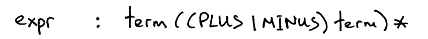

We're going to use all the knowledge you've gained from previous articles in the series and learn how to parse and interpret arithmetic expressions that have any number of addition, substraction, multiplication, and division operators.

Before diving in and writing some code, let's talk about the associativity and precedence of operators.


Above is the precedence table, you can tell that operators + and - have the same precedence level and they are both left-associative. You can also see that operators * and / are also left-associative, have the same precedence among themselves but have higher-precedence than addition and subtraction operators.

Here are the rules for how to construct a grammar from the precedence table:

1. For each level of precedence define a non-terminal. The body of a production for the non-terminal should contain arithmetic operators from that level and non-terminals for the next higher level of precedence.

1. Create an additional non-terminal *fator* for the basic units of expression, in this case, integers. The general rule is that if you have N levels of precedence, you will need N+1 non-terminals in total: one non-terminal for each level plus one non-terminal for basic units of expression.

According to Rule 1 we will define two non-terminals: a non-terminal called *expr* for level 2 and a non-terminal called *term* for level 1. And by following Rule 2 we will define a *factor* non-terminal for basic units of arithmetic expressions, integers.

The *start symbol* will be *expr* and the *expr* production will contain a body representing the use of operators from level 2, which in this case are operators + and -, and will contain *term* non-terminals for the next higher level of precedence, level 1:



The *term* production will have a body representing the use of operators from level 1, which are operators * and /, and it will contain the non-terminal *factor* for the basic units of expression, integers:


And the production for the non-terminal *factor* will be:


Here is a syntax diagram that corresponds to the grammar above, each rectangular box in the diagram is a "method call" to another diagram.


To drive the precedence of operators point home, let's take a look at the decomposition of the same arithmetic expression *7 + 5 * 2* done in accordance with our grammar and syntax diagrams above. This is just another way to show that *higher-precedence* operators execute before operators with *lower-precedence*:


The following are the main changes compared with the code from [calc4.py](./calc4.py)

- The *Lexer* class can now tokenize +,-,* and / (Nothing new here, we just combined code from previous articles into one class that supports all those tokens)

- Recall that each rule (production), R, defined in the grammar, becomes a method with the same name, and references to that rule become a method call: R(). As a result the *Interpreter* class now has three methods that correspond to non-terminals in the grammar: *expr, term, factor*.

```python
# Token types
#
# EOF (end-of-file) token is used to indicate that
# there is no more input left for lexical analysis
INTEGER, PLUS, MINUS, MUL, DIV, EOF = (
    'INTEGER', 'PLUS', 'MINUS', 'MUL', 'DIV', 'EOF'
)


class Token(object):
    def __init__(self, type, value):
        # token type: INTEGER, PLUS, MINUS, MUL, DIV, or EOF
        self.type = type
        # token value: non-negative integer value, '+', '-', '*', '/', or None
        self.value = value

    def __str__(self):
        """String representation of the class instance.

        Examples:
            Token(INTEGER, 3)
            Token(PLUS, '+')
            Token(MUL, '*')
        """
        return 'Token({type}, {value})'.format(
            type=self.type,
            value=repr(self.value)
        )

    def __repr__(self):
        return self.__str__()


class Lexer(object):
    def __init__(self, text):
        # client string input, e.g. "3 * 5", "12 / 3 * 4", etc
        self.text = text
        # self.pos is an index into self.text
        self.pos = 0
        self.current_char = self.text[self.pos]

    def error(self):
        raise Exception('Invalid character')

    def advance(self):
        """ Adavance the `pos` pointer and set the `current_char` variable. """
        self.pos += 1
        if self.pos > len(self.text) - 1:
            self.current_char = None    # Indicates end of input
        else:
            self.current_char = self.text[self.pos]

    def skip_whitespace(self):
        while self.current_char is not None and self.current_char.isspace():
            self.advance()

    def integer(self):
        """ Return a (multidigit) integer consumed from the input """
        result = ''
        while self.current_char is not None and self.current_char.isdigit():
            result += self.current_char
            self.advance()
        return int(result)

    def get_next_token(self):
        """Lexical analyzer (also known as scanner or tokenizer)

        This method is responsible for breaking a sentence
        apart into tokens. One token at a time.
        """
        while self.current_char is not None:
            if self.current_char.isspace():
                self.skip_whitespace()
                continue

            if self.current_char.isdigit():
                return Token(INTEGER, self.integer())

            if self.current_char == '+':
                self.advance()
                return Token(PLUS, '+')

            if self.current_char == '-':
                self.advance()
                return Token(MINUS, '-')

            if self.current_char == '*':
                self.advance()
                return Token(MUL, '*')

            if self.current_char == '/':
                self.advance()
                return Token(DIV, '/')

            self.error()
        return Token(EOF, None)

class Interpreter(object):
    def __init__(self, lexer):
        self.lexer = lexer
        # set current token to the first token taken from the input
        self.current_token = self.lexer.get_next_token()

    def error(self):
        raise Exception('Invalid syntax')

    def eat(self, token_type):
        # compare the current token type with the passed token
        # type and if they match then "eat" the current token
        # and assign the next token to the self.current_token,
        # otherwise raise an exception.
        if self.current_token.type == token_type:
            self.current_token = self.lexer.get_next_token()
        else:
            self.error()
    
    def factor(self):
        """factor : INTEGER"""
        token = self.current_token
        self.eat(INTEGER)
        return token.value

    def term(self):
        """ term: factor (( MUL | DIV ) factor)* """
        result = self.factor()

        while self.current_token.type in (MUL, DIV):
            token = self.current_token
            if token.type == MUL:
                self.eat(MUL)
                result = result * self.factor()
            elif token.type == DIV:
                self.eat(DIV)
                result = result / self.factor()
            
        return result

    def expr(self):
        """ Arithmetic expressoin parser / interpreter.

        calc>  14 + 2 * 3 - 6 / 2
        17

        expr   : term ((PLUS | MINUS) term)*
        term   : factor ((MUL | DIV) factor)*
        factor : INTEGER
        """
        result = self.term()

        while self.current_token.type in (PLUS, MINUS):
            token = self.current_token
            if token.type == PLUS:
                self.eat(PLUS)
                result += self.term()
            elif token.type == MINUS:
                self.eat(MINUS)
                result -= self.term()
            
        return result

def main():
    while True:
        try:
            text = input('calc>')
        except EOFError:
            break
        if not text:
            continue
        lexer = Lexer(text)
        interpreter = Interpreter(lexer)
        result = interpreter.expr()
        print(result)


if __name__ == '__main__':
    main()
```

[Next we'll add the parentheses](./part-6.md)
