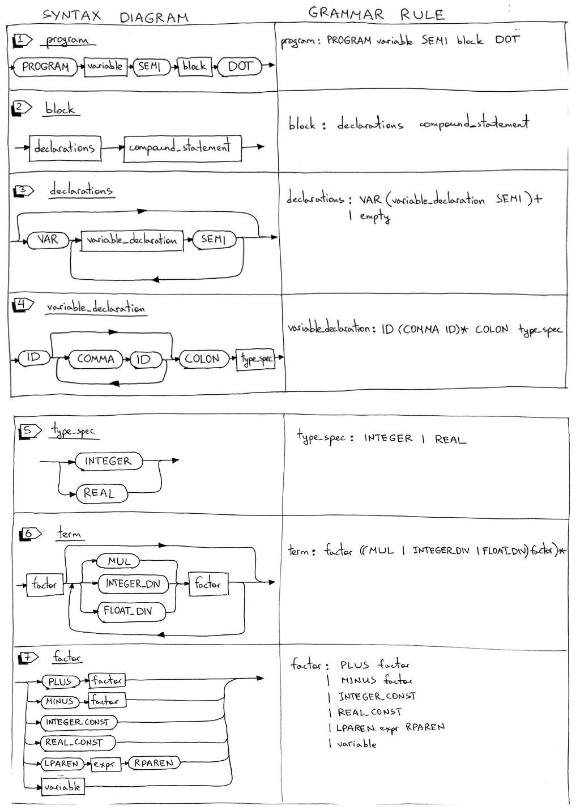

In this article we will update our interpreter to parse and interpret our very first complete Pascal program. The program can also be compiled by the [Free Pascal compiler, fpc](http://www.freepascal.org/).

What we're going to cover in this article:

1. How to parse and interpret the Pascal *PROGRAM* header
1. How to parse Pascal variable declarations
1. Update the interpreter to use the *DIV* keyword for integer division and a forward slash */* for float division
1. Support for Pascal comments

Dive in and look at the grammar changes first. We'll add some new rules and update some of the existing rules.



1. The program definition grammar rule is updated to include the *PROGRAM* reserved keyword, the program name, and a block that ends with a dot. Here is an example of a complete Pascal program:

        PROGRAM Part10;
        BEGIN
        END.

1. The *block* rule combines a declarations rule and a *compound_statement* rule. We'll also use the rule later in the series when we add procedure declarations. Here is an example of a block:

        VAR
        number : INTEGER;

        BEGIN
        END

        # or

        BEGIN
        END

1. Pascal declarations have several parts and each part is optional. In this article, we'll cover the variable declaration part only. The *declarations* rule has either a variable declaration sub-rule or it's empty.

1. Pascal is a statically typed language, which means that every variable needs a variable declaration that explicitly specifies its type. In Pascal, variables must be declared before they are used. This is achieved by declaring variables in the program variable declaration section using the *VAR* reserved keyword. You can define variables like this:

        VAR
        number     : INTEGER;
        a, b, c, x : INTEGER;
        y          : REAL;

1. The *type_spec* rule is for handling *INTEGER* and *REAL* types and is used in variable declarations. In the example below

        VAR
        a : INTEGER;
        b : REAL;

1. The *term* rule is updated to use the *DIV* keyword for integer division and a forward slash */* for float division.

    Before, dividing 20 by 7 using a forward slash would produce an INTEGER 2:

        20 / 7 = 2

    Now, dividing 20 by 7 using a forward slash will produce a REAL (floating point number) 2.85714285714 :

        20 / 7 = 2.85714285714

    From now on, to get an INTEGER instead of a REAL, you need to use the *DIV* keyword:

        20 DIV 7 = 2

1. The *factor* rule is updated to handle both integer and real (float) constants. I also removed the INTEGER sub-rule because the constants will be represented by *INTEGER_CONST* and *REAL_CONST* tokens and the *INTEGER* token will be used to represent the integer type. In the example below the lexer will generate an *INTEGER_CONST* token for 20 and 7 and a *REAL_CONST* token for 3.14 :

        y := 20 / 7 + 3.14;

    Here is our complete grammar for today:

        program : PROGRAM variable SEMI block DOT

        block : declarations compound_statement

        declarations : VAR (variable_declaration SEMI)+
                    | empty

        variable_declaration : ID (COMMA ID)* COLON type_spec

        type_spec : INTEGER

        compound_statement : BEGIN statement_list END

        statement_list : statement
                    | statement SEMI statement_list

        statement : compound_statement
                | assignment_statement
                | empty

        assignment_statement : variable ASSIGN expr

        empty :

        expr : term ((PLUS | MINUS) term)*

        term : factor ((MUL | INTEGER_DIV | FLOAT_DIV) factor)*

        factor : PLUS factor
            | MINUS factor
            | INTEGER_CONST
            | REAL_CONST
            | LPAREN expr RPAREN
            | variable

        variable: ID

In the rest of the article we'll go through the same drill we went through last time:

1. Update the lexer
1. Update the parser
1. Update the interpreter

## Update the lexer

Here is a summary of the lexer changes:

1. New tokens
1. New and updated reserved keywords
1. New *skip_comments* method to handle Pascal comments
1. Rename the *integer* method and make some changes to the method itself
1. Update the *get_next_token* method to return new tokens

One by one:

1. To handle a program header, variable declarations, integer and float constants as well as integer and float division, we need to add some new tokens - some of which are reserved keywords - and we also need to update the meaning of the INTEGER token to represent the integer type and not an integer constant. Here is a complete list of new and updated tokens:

    - PROGRAM (reserved keyword)
    - VAR (reserved keyword)
    - COLON (:)
    - COMMA (,)
    - INTEGER (we change it to mean integer type and not integer constant like 3 or 5)
    - REAL (for Pascal REAL type)
    - INTEGER_CONST (for example, 3 or 5)
    - REAL_CONST (for example, 3.14 and so on)
    - INTEGER_DIV for integer division (the DIV reserved keyword)
    - FLOAT_DIV for float division ( forward slash / )

1. Here is the complete mapping of reserved keywords to tokens:

    ```python
    RESERVED_KEYWORDS = {
        'PROGRAM': Token(PROGRAM, 'PROGRAM'),
        'VAR': Token(VAR, 'VAR'),
        'DIV': Token(INTEGER_DIV, 'DIV'),
        'INTEGER': Token(INTEGER, 'INTEGER'),
        'REAL': Token(REAL, 'REAL'),
        'BEGIN': Token(BEGIN, 'BEGIN'),
        'END': Token(END, 'END'),
    }
    ```

1. We're adding the *skip_comment* method to handle Pascal comments. The method is pretty basic and all it does is discard all the characters until the closing curly brace is found:

    ```python
    def skip_comment(self):
        while self.current_char != '}':
            self.advance()
        self.advance()  # the closing curly brace
    ```

1. We are renaming the integer method the number method. It can handle both integer constants and float constants like 3 and 3.14:

    ```python
    def number(self):
        """Return a (multidigit) integer or float consumed from the input."""
        result = ''
        while self.current_char is not None and self.current_char.isdigit():
            result += self.current_char
            self.advance()

        if self.current_char == '.':
            result += self.current_char
            self.advance()

            while (
                self.current_char is not None and
                self.current_char.isdigit()
            ):
                result += self.current_char
                self.advance()

            token = Token('REAL_CONST', float(result))
        else:
            token = Token('INTEGER_CONST', int(result))

        return token
    ```

1. We're also updating the *get_next_token* method to return new tokens:

    ```python
    def get_next_token(self):
        while self.current_char is not None:
            ...
            if self.current_char == '{':
                self.advance()
                self.skip_comment()
                continue
            ...
            if self.current_char.isdigit():
                return self.number()

            if self.current_char == ':':
                self.advance()
                return Token(COLON, ':')

            if self.current_char == ',':
                self.advance()
                return Token(COMMA, ',')
            ...
            if self.current_char == '/':
                self.advance()
                return Token(FLOAT_DIV, '/')
            ...
    ```

## Updating the Parser

Here is a summary of the changes:

1. New AST nodes: *Program, Block, VarDecl, Type*
1. New methods corresponding to new grammar rules: *block, declarations, variable_declaration, type_spec*.
1. Updates to the existing parser methods: *program, term, factor*

One by one:

1. We'll start with new AST nodes first. There are four new nodes:

    - The *Program* AST node represents a program and will be our root node

        ```python
        class Program(AST):
            def __init__(self, name, block):
                self.name = name
                self.block = block
        ```

    - The *Block* AST node holds declarations and a compound statement:

        ```python
        class Block(AST):
            def __init__(self, declarations, compound_statement):
                self.declarations = declarations
            self.compound_statement = compound_statement
        ```

    - The *VarDecl* AST node represents a variable declaration. It holds a variable node and a type node:

        ```python
        class VarDecl(AST):
            def __init__(self, var_node, type_node):
                self.var_node = var_node
                self.type_node = type_node
        ```

    - The *Type* AST node represents a variable type (INTEGER or REAL):

        ```python
        class Type(AST):
            def __init__(self, token):
                self.token = token
                self.value = token.value
        ```

1. Each rule from the grammar has a corresponding method in our recursive-descent parser. Today we're adding four new methods: *block, declarations, variable_declaration*, and *type_spec*. These methods are responsible for parsing new language constructs and constructing new AST nodes:

    ```python
    def block(self):
        """ block : declarations compound_statement """
        declaration_nodes = self.declarations()
        compound_statement_node = self.compound_statement()
        node = Block(declaration_nodes, compound_statement_node)
        return node

    def declarations(self):
        """
        declarations : VAR (variable_declaration SEMI)+
                    | empty
        """
        declarations = []
        if self.current_token.type == VAR:
            self.eat(VAR)
            while self.current_token.type == ID:
                var_decl = self.variable_declaration()
                declarations.extend(var_decl)
                self.eat(SEMI)
        return declarations

    def variable_declaration(self):
        """ variable_declaration : ID (COMMA ID)* COLON type_spec """
        var_nodes = [Var(self.current_token)] # first ID
        self.eat(ID)

        while self.current_token.type == COMMA:
            self.eat(COMMA)
            var_nodes.append(Var(self.current_token))
            self.eat(ID)

        self.eat(COLON)

        type_node = self.type_spec()
        var_declarations = [
            VarDecl(var_node, type_node) for var_node in var_nodes
        ]
        return var_declarations

    def type_spec(self):
        """ type_spec : INTEGER
                    | REAL
        """
        token = self.current_token
        if self.current_token.type == INTEGER:
            self.eat(INTEGER)
        else:
            self.eat(REAL)
        node = Type(token)

        retun node
    ```

1. We also need to update the *program, term*, and *factor* methods to accommodate the grammar changes:

    ```python
    def program(self):
        """ program: PROGRAM variable SEMI block DOT """
        self.eat(PROGRAM)
        var_node = self.variable()
        prog_name = var_node.value
        self.eat(SEMI)
        block_node = self.block()
        program_node = Program(prog_name, block_node)
        self.eat(DOT)
        return program_node

    def term(self):
        """term : factor ((MUL | INTEGER_DIV | FLOAT_DIV) factor)*"""
        node = self.factor()

        while self.current_token.type in (MUL, INTEGER_DIV, FLOAT_DIV):
            token = self.current_token
            if token.type == MUL:
                self.eat(MUL)
            elif token.type == INTEGER_DIV:
                self.eat(INTEGER_DIV)
            elif token.type == FLOAT_DIV:
                self.eat(FLOAT_DIV)

            node = BinOp(left=node, op=token, right=self.factor())

        return node

    def factor(self):
        """factor : PLUS factor
                | MINUS factor
                | INTEGER_CONST
                | REAL_CONST
                | LPAREN expr RPAREN
                | variable
        """
        token = self.current_token
        if token.type == PLUS:
            self.eat(PLUS)
            node = UnaryOp(token, self.factor())
            return node
        elif token.type == MINUS:
            self.eat(MINUS)
            node = UnaryOp(token, self.factor())
            return node
        elif token.type == INTEGER_CONST:
            self.eat(INTEGER_CONST)
            return Num(token)
        elif token.type == REAL_CONST:
            self.eat(REAL_CONST)
            return Num(token)
        elif token.type == LPAREN:
            self.eat(LPAREN)
            node = self.expr()
            self.eat(RPAREN)
            return node
        else:
            node = self.variable()
            return node
    ```

## Updating the Interpreter

There will be four new methods to visit our new nodes:

- visit_Program
- visit_Block
- visit_VarDecl
- visit_Type

They are pretty straightforward. You can also see that the Interpreter does nothing with *VarDecl* and *Type* nodes:

```python
def visit_Program(self, node):
    self.visit(node.block)

def visit_Block(self, node):
    for declaration in node.declarations:
        self.visit(declaration)
    self.visit(node.compound_statement)

def visit_VarDecl(self, node):
    pass

def visit_Type(self, node):
    pass
```

We also need to update the *visit_BinOp* method to properly interpret integer and float divisions:

```python
def visit_BinOp(self, node):
    if node.op.type == PLUS:
        return self.visit(node.left) + self.visit(node.right)
    elif node.op.type == MINUS:
        return self.visit(node.left) - self.visit(node.right)
    elif node.op.type == MUL:
        return self.visit(node.left) * self.visit(node.right)
    elif node.op.type == INTEGER_DIV:
        return self.visit(node.left) / self.visit(node.right)
    elif node.op.type == FLOAT_DIV:
        return float(self.visit(node.left)) / float(self.visit(node.right))
```

[Next, more detail about symbol table management](./part-11.md)
