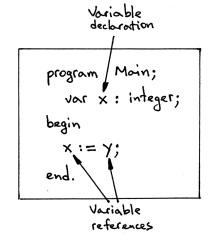
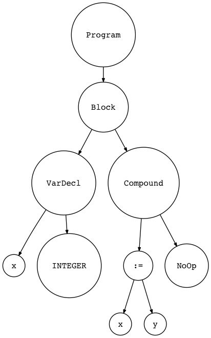
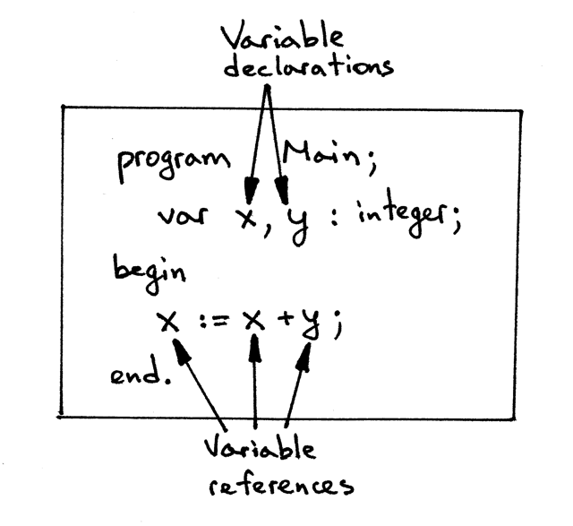
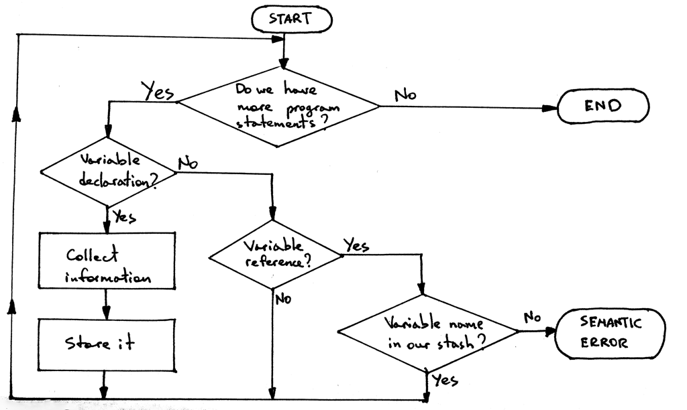

## Introduction to semantic analysis

While our Pascal program can be grammatically correct and the parser can successfully build an *abstract syntax tree*, the program still can contain some pretty serious errors. To catch those errors we need to use the *abstract syntax tree* and the informaiton from the *symbol table*.

Why can't we check for those errors during parsing, that is, during *syntax analysis*? Why do we have to build an *AST* and something called the symbol table to do that?

In a nutshell, for convenience and the separation of concerns. By moving those extra checks into a separate phase, we can focus on one taks at a time without making our parser and interpreter do more work than they are supposed to do.

When the parser has finished building the AST, we know that the program is grammatically correct; that is, that its syntax is correct according to our grammar rules and now we can separately focus on checking for errors that require additional context and information that the parser did not have at the time of building the AST. To make it more concrete, let's take a look at the following Pascal assignment statement:

    x := x + y;

The parser will handle it all right because, grammatically, the statement is correct (according to our previously defined grammar rules for assignment statements and expressions). But that's not the end of the story yet, because Pascal has a requirement that variables must be declared with their corresponding types before they are used. How does the parser know whether x and y have been declared yet?

Well, it doesn't and that's why we need a separate semantic analysis phase to answer the question (among many others) of whether the variables have been declared prior to their use.

Basically, *semantic analysis* is just a process to help us determine whether a program makes sense, and that it has meaning, according to a language definition.

What does it even mean for a program to make sense? It depends in large part on a language definition and language requirements.

Pascal language and, specifically, Free Pascal's compiler, has certain requirements that, if not followed in a program, would lead to an error from the *fpc* compiler indicating that the program doesn't "make sense", that it is correct, even though the syntax might look okay. Here are some of those requirements:

- The variables must be declared before they are used

- The variable must have matching types when used in arithmetic expressions (this is a big part of *semantic analysis* called *type checking* that we'll cover separately).

- There should be no duplicate declarations (Pascal prohibits, for example, having a local variable in a procedure with the same name as one of the procedure's formal parameters)

- A name reference in a call to procedure must refer to the actual declared procedure (It doesn't make sense in Pascal if, in the procedure call foo(), the name *foo* refers to a variable foo of a primitive type INTEGER)

- A procedure call must have the correct number of arguments and the arguments' types must match those of formal parameters in the procedure declaration

It is much easier to enforce the above requirements when we have enough context about the program, namely, an intermediate representation in the form of an AST that we can walk and the symbol table with information about different program entities like variables, procedures, and functions.

After we implement the semantic analysis phase, the structure of our Pascal interpreter will look something like this:


From the picture above you can see that our lexer will get source code as an input, transform that into tokens that the parser will consume and use to verify that the program is grammatically correct, and then it will generate an abstract syntax tree that our new semantic analysis phase will use to enforce different Pascal language requirements. During the semantic analysis phase, the semantic analyzer will also build and use the symbol table. After the semantic analysis, our interpreter will take the AST, evaluate the program by walking the AST, and produce the program output.

Let's get into the details of the semantic analysis phase.

*Symbols and symbol tables*

In the following section, we're going to discuss how to implement some of the semantic checks and how to build the symbol table: in other words, we are going to discuss how to perform a semantic analysis of our Pascal programs. 

Even though *semantic analysis* sounds fancy and deep, it's just another step after parsing our program and creating an AST to check the source program for some additional errors that the parser couldn't catch due to a lack of additional information (context).

Today we're going to focus on the following two static semantic checks*:

1. That variables are declared before they are used
1. That there are no duplicate variable declarations

> *ASIDE: Static semantic checks are the checks that we can make before interpreting (evaluating) the program, that is, before calling the interpret method on an instance of the Interpreter class. All the Pascal requirements mentioned before can be enforced with static semantic checks by walking an AST and using information from the symbol table.
>
> Dynamic semantic checks, on the other hand, would require checks to be performed during the interpretation (evaluation) of the program. For example, a check that there is no division by zero, and that an array index is not out of bounds would be a dynamic semantic check. Our focus today is on static semantic checks.

Let's start with our first check and make sure that in our Pascal programs variables are declared before they are used. Take a look at the following syntactically correct but semantically incorrect program: 

    program Main;
        var x : integer;

    begin
        x := y;
    end.

The program above has one variable declaration and two variable references.



Here is the AST diagram for the above program:



So, it is a grammatically (syntactically) correct program, but the program doesn't make sense because we don't even know what type the variable y has (that's why we need declarations) and if it will make sense to assign y to x. What if y is a string, does it make sense to assign a string to an integer? It does not, at least not in Pascal.

So the program above has a semantic error because the variable y is not declared and we don't know its type. In order for us to be able to catch errors like that, we need to learn how to check that variables are declared before they are used.

A both syntactically correct and semantically correct sample program would be like this:

    program Main;
        var x,y : integer;
    
    begin
        x := x + y;
    end.

1. It has two variable declarations: x and y

1. It has also three variable references 



The program is grammatically correct, all the variables are declared, and we can see that adding two integers and assigning the result to an integer makes perfect sense. 

But how do we programmatically check that the variables (variable references) x and y in the assignment statement `x := x +y;` have been declared?

We can do this in several steps by implementing the following algorithm:

1. Go over all variable declarations
1. For every variable declaration you encounter, collect all necessary information about the declared variable
1. Store the collected information in some stash for future reference by using the variables name as a key
1. When you see a variable reference, such as in the assignment statement `x := x + y`, search the stash by the variable's name to see if the stash has any information about the variable. If it does, the variable has been declared. If it doesn't, the variable hasn't been declared yet, which is a semantic error.

This is what a flowchart of our algorithm could look like:



Before we can implement the algorithm, we need to answer several questions:

- A. What information about variables do we need to collect?
- B. Where and how should we store the collected information?
- C. How do we implement the "go over all variable declarations" step?

So, what necessary information do we need to collect about a variable? Here are the important parts:

* Name (the name of a declared variable which we will be looking up variables by their names later)
* Category (what kind of an identifier it is: variable, type, procedure, and so on)
* Type (for type checking)

Symbols will hold that information (name, category, type) about the variables.

Again, a *symbol* is an identifier of some program entity like a variable, subroutine, or built-in type.

In the code, we'll represent symbols with a class called *Symbol* that has fields *name* and *type* :

```python
class Symbol(object):
    def __init__(self, name, type=None):
        self.name = name
        self.type = type
```

What about the *category*?

We will encode category into the class name. Alternatively, we could store the category of a symbol in the dedicated *category* field of the *Symbol* class as in:

```python
class Symbol(object):
    def __init__(self, name, type=None):
        self.name = name
        self.type = type
        self.category = category
```

However, it's more explicit to create a hierarchy of classes where the name of the class indicates its category.

You can see that variables x and y are declared as integers from the sample code above. What is the *integer* type? The integer type is another kind of symbol, a *built-in type symbol*. It's called built-in because it doesn't have to be declared explicitly in a Pascal program.

It's the interpreter's responsibility to declare that type symbol and make it available to programmers.

We are going to make a separate class for built-in types called *BuiltinTypeSymbol*. Here is the class definition for our built-in types:

```python
class BuiltinTypesSymbol(Symbol):
    def __init__(self, name):
        super().__init__(name)
    
    def __str__(self):
        return self.name

    def __repr__(self):
        return "<{class_name}(name='{name}')".format(
            class_name=self.__class__.__name__,
            name=self.name
        )
```

The class *BuiltinTypeSymbol* inherits from the *Symbol* class, and its constructor requires only the *name* of the type, like *INTEGER* or *REAL*. 

The 'builtin type' category is encoded in the class name, as we discussed earlier, and the *type* parameter from the base class is automatically set to *None* when we create a new instance of the *BuiltinTypeSymbol* class.

>
> ASIDE
>
> The double underscore or dunder (as in “Double UNDERscore”) methods `__str__` and `__repr__` are special Python methods. We've defined them to have a nice formatted message when we print a symbol object to standard output.
>

By the way, built-in types are the reason why the type parameter in the Scope class constructor is an optional parameter.

Now comes the variable symbols.

We represent them in code by a *VarSymbol* class:

```python
class VarSymbol(Symbol):
    def __init__(self, name, type):
        super().__init__(name, type)
    
    def __str__ (self):
        return "<{class_name}(name='{name}', type='{type}')>".format(
            class_name=self.__class__.__name__,
            name=self.name,
            type=self.type,
        )

    __repr__ = __str__
```

In this class, we made both the *name* and the *type* parameters required and the class name *VarSymbol* clearly indicates that an instance of the class will identify a variable symbol (the category is *variable*). The *type* parameter is an instance of the *BuiltinTypeSymbol* class.

Okay, now onto "Where and how should we store the collected information?"

The answer is the *symbol table*. A symbol table is an abstract data type for tracking various symbols in source code. Think of it as a dictionary where the key is the symbol's name and the value is an instance of the symbol class (or one of its subclasses). We'll create a dedicated class aptly named *SymbolTable* with an *insert* method, which takes a symbol as a parameter and store it internally in the *_symbol* ordered dictionary using the symbol's name as a key and the symbol instance as a value, to store symbols into the table.

```python
class SymbolTable(object):
    def __init__(self):
        self._symbols = OrderedDict()
    
    def __str__(self):
        symtab_header = 'Symbol table contents'
        lines = ['\n', symtab_header, '_' * len(symtab_header)]
        lines.extend(
            ( '%7s: %r' % (k,v) ) for k,v in self._symbols.items()
        )
        lines.append('\n')
        s = '\n'.join(lines)
        return s

    __repr__ = __str__

    def insert(self, symbol):
        print('Insert: %s ' % symbol.name)
        self._symbols[symbol.name] = symbol
```

Now, "How do we implement the 'go over all variable declarations' step?"

It's pretty easy because we already have an AST built by the parser. What we need to do is just to create a new AST visitor class that will be responsible for walking over the tree and doing different actions when visiting *VarDecl* AST nodes!

Below is the skeleton for the *SemanticAnalyzer* class with enough *visit_xxx* methods to be able to successfully walk the AST of the sample program above:

```python
class SemanticAnalyzer(NodeVisitor):
    def __init__(self):
        self.symtab = SymbolTable()
    
    def visit_Block(self, node):
        for declaration in node.declarations:
            self.visit(declaration)
        self.visit(node.compound_statement)
    
    def visit_Program(self, node):
        self.visit(node.block)

    def visit_Compound(self, node):
        for child in node.children:
            self.visit(child)
    
    def visit_NoOp(self, node):
        pass
    
    def visit_VarDecl(self, node):
        

        # We have all the information we need to create a variable symbol
        # Create the symbol and insert it into the symbol table
        var_name = node.var_node.value
        var_symbol = VarSymbol(var_name, type_symbol)
```

Here are the steps of the algorithm for static semantic check again:

1. Go over all variable declarations
1. For every variable declaration you encounter, collect all necessary information about the declared variable
1. Store the collected information in some stash for future references by using the variable's name as a key
1. When you see a variable reference such as in the assignment statement x := x + y, search the stash by the variable's name to see if the stash has any information about the variable. If it does, the variable has been declared. If it doesn't, the variable hasn't been declared yet, which is a semantic error.

For step 4, we need make some changes to the symbol table and semantic analyzer:

1. Add a method to our symbol table that will be able to look up a symbol by name

1. Update the semantic analyzer to look up a name in the symbol table every time it encounters a variable reference

So, adding the *lookup* method, which takes a symbol name as a parameter and returns a symbol if it finds it or *None* if not, to *SymbolTable*:

```python
class SymbolTable(object):
    ...

    def lookup(self,name):
        print('Lookup: %s' % name)
        symbol = self._symbols.get(name)
    
        # 'symbol' is either an instance of the Symbol class or None
        return symbol
```

Also, we need update the *SymbolTable* class to initialize built-in types by adding a method *_init_builtins* and calling it in the *SymbolTable*'s constructor.

Here is the full code for our updated *SymbolTable* class:

```python
class SymbolTable(object):
    def __init__(self):
        self._symbols = OrderedDict()
        self._init_builtins()

    def _init_builtins(self):
        self.insert(BuiltinTypeSymbol('INTEGER'))
        self.insert(BuiltinTypeSymbol('REAL'))

    def __str__(self):
        symtab_header = 'Symbol table contents'
        lines = ['\n', symtab_header, '_' * len(symtab_header)]
        lines.extend(
            ('%7s: %r' % (key, value))
            for key, value in self._symbols.items()
        )
        lines.append('\n')
        s = '\n'.join(lines)
        return s

    __repr__ = __str__

    def insert(self, symbol):
        print('Insert: %s' % symbol.name)
        self._symbols[symbol.name] = symbol

    def lookup(self, name):
        print('Lookup: %s' % name)
        symbol = self._symbols.get(name)
        # 'symbol' is either an instance of the Symbol class or None
        return symbol
```

We need to update the *SemanticAnalyzer*'s *visit_VarDecl* method:

```python
def visit_VarDecl(self, node):
    type_name = node.type_node.value
    type_symbol = self.symtable.lookup(type_name)


    # We have all the information we need to create a variable symbol.
    # Create the symbol and insert it into the symbol table.
    var_name = node.var_node.value
    var_symbol = VarSymbol(var_name, type_symbol)
    self.symtab.insert(var_symbol)
```

Now let's switch our attention to variable references. What we need to do is extend our semantic analyzer so that every time it encounters a variable reference it would search the symbol table by the variable reference name using the symbol table's *lookup* name. We would add a method called *visit_Var*:

```python
def visit_Var(self, node):
    var_name = node.value
    var_symbol = self.symtab.lookup(var_name)
```

Usually we encounter the variable references in the *assignment* or *operation*, we need to add responding visit methods, for example:

```python
def visit_Assign(self, node):
    # right-hand side
    self.visit(node.right)

    # left-hande side
    self.visit(node.left)

def visit_BinOp(self, node):
    self.visit(node.left)
    self.visit(node.right)
```

Literally, we have implemented all of the steps of the algorithm for a static semantic check that verifies that all variables in the program are declared before they are used!

*Semantic Errors*

What if our program has a variable reference that doesn't resolve to any declaration; that is, it's not declared? That's a semantic error and we need to extend our semantic analyzer to signal that error. 

To signal the error, we need to modify the *SemanticAnalyzer*'s *visit_Var* method to throw an exception if the *lookup* method cannot resolve a name to a symbol and returns *None*. Here is the updated code for *visit_Var*:

```python
def visit_Var(self, node):
    var_name = node.value
    var_symbol = self.symtab.lookup(var_name)
    if var_symbol is None:
        raise Exception(
            "Error: Symbol(identifier) not found '%s'" % var_name
        )
```

That is good for reference checking, now we need to move on to another static semantic check.

For fun and profit, let's extend the semantic analyzer to check duplicate identifiers in declarations. We need to modify the *visit_VarDecl* method to check whether the symbol table already has a symbol with the same name before inserting a new symbol.

```python
def visit_VarDecl(self, node):
    type_name = node.type_node.value
    type_symbol = self.symtab.lookup(type_name)

    # We have all the information we need to create a variable symbol.
    # Create the symbol and insert it into the symbol table.
    var_name = node.var_node.value
    var_symbol = VarSymbol(var_name, type_symbol)

    # Signal an error if the table alrady has a symbol
    # with the same name
    if self.symtab.lookup(var_name) is not None:
        raise Exception(
            "Error: Duplicate identifier '%s' found" % var_name
        )

    self.symtab.insert(var_symbol)
```

[Next, we'll tackle the topic of scopes and semantic checks in the presence of nested scopes](./part-14.md)


## Appendix

```python
""" SPI - Simple Pascal Interpreter. Part 13."""

from collections import OrderedDict

###############################################################################
#                                                                             #
#  LEXER                                                                      #
#                                                                             #
###############################################################################

# Token types
#
# EOF (end-of-file) token is used to indicate that
# there is no more input left for lexical analysis
INTEGER = 'INTEGER'
REAL = 'REAL'
INTEGER_CONST = 'INTEGER_CONST'
REAL_CONST = 'REAL_CONST'
PLUS = 'PLUS'
MINUS = 'MINUS'
MUL = 'MUL'
INTEGER_DIV = 'INTEGER_DIV'
FLOAT_DIV = 'FLOAT_DIV'
LPAREN = 'LPAREN'
RPAREN = 'RPAREN'
ID = 'ID'
ASSIGN = 'ASSIGN'
BEGIN = 'BEGIN'
END = 'END'
SEMI = 'SEMI'
DOT = 'DOT'
PROGRAM = 'PROGRAM'
VAR = 'VAR'
COLON = 'COLON'
COMMA = 'COMMA'
PROCEDURE = 'PROCEDURE'
EOF = 'EOF'


class Token(object):
    def __init__(self, type, value):
        self.type = type
        self.value = value

    def __str__(self):
        """String representation of the class instance.

        Examples:
            Token(INTEGER, 3)
            Token(PLUS, '+')
            Token(MUL, '*')
        """
        return 'Token({type}, {value})'.format(
            type=self.type,
            value=repr(self.value)
        )

    def __repr__(self):
        return self.__str__()


RESERVED_KEYWORDS = {
    'PROGRAM': Token(PROGRAM, 'PROGRAM'),
    'PROCEDURE': Token(PROCEDURE, 'PROCEDURE'),
    'VAR': Token(VAR, 'VAR'),
    'DIV': Token(INTEGER_DIV, 'DIV'),
    'INTEGER': Token(INTEGER, 'INTEGER'),
    'REAL': Token(REAL, 'REAL'),
    'BEGIN': Token(BEGIN, 'BEGIN'),
    'END': Token(END, 'END'),
}


class Lexer(object):
    def __init__(self, text):
        # client string input, e.g. "4 + 2 * 3 - 6 / 2"
        self.text = text
        # self.pos is an index into self.text
        self.pos = 0
        self.current_char = self.text[self.pos]

    def error(self):
        raise Exception('Invalid character')

    def advance(self):
        """Advance the `pos` pointer and set the `current_char` variable."""
        self.pos += 1
        if self.pos > len(self.text) - 1:
            self.current_char = None  # Indicates end of input
        else:
            self.current_char = self.text[self.pos]

    def peek(self):
        peek_pos = self.pos + 1
        if peek_pos > len(self.text) - 1:
            return None
        else:
            return self.text[peek_pos]

    def skip_whitespace(self):
        while self.current_char is not None and self.current_char.isspace():
            self.advance()

    def skip_comment(self):
        while self.current_char != '}':
            self.advance()
        self.advance()  # the closing curly brace

    def number(self):
        """Return a (multidigit) integer or float consumed from the input."""
        result = ''
        while self.current_char is not None and self.current_char.isdigit():
            result += self.current_char
            self.advance()

        if self.current_char == '.':
            result += self.current_char
            self.advance()

            while (
                self.current_char is not None and
                self.current_char.isdigit()
            ):
                result += self.current_char
                self.advance()

            token = Token(REAL_CONST, float(result))
        else:
            token = Token(INTEGER_CONST, int(result))

        return token

    def _id(self):
        """Handle identifiers and reserved keywords"""
        result = ''
        while self.current_char is not None and self.current_char.isalnum():
            result += self.current_char
            self.advance()

        token = RESERVED_KEYWORDS.get(result, Token(ID, result))
        return token

    def get_next_token(self):
        """Lexical analyzer (also known as scanner or tokenizer)

        This method is responsible for breaking a sentence
        apart into tokens. One token at a time.
        """
        while self.current_char is not None:

            if self.current_char.isspace():
                self.skip_whitespace()
                continue

            if self.current_char == '{':
                self.advance()
                self.skip_comment()
                continue

            if self.current_char.isalpha():
                return self._id()

            if self.current_char.isdigit():
                return self.number()

            if self.current_char == ':' and self.peek() == '=':
                self.advance()
                self.advance()
                return Token(ASSIGN, ':=')

            if self.current_char == ';':
                self.advance()
                return Token(SEMI, ';')

            if self.current_char == ':':
                self.advance()
                return Token(COLON, ':')

            if self.current_char == ',':
                self.advance()
                return Token(COMMA, ',')

            if self.current_char == '+':
                self.advance()
                return Token(PLUS, '+')

            if self.current_char == '-':
                self.advance()
                return Token(MINUS, '-')

            if self.current_char == '*':
                self.advance()
                return Token(MUL, '*')

            if self.current_char == '/':
                self.advance()
                return Token(FLOAT_DIV, '/')

            if self.current_char == '(':
                self.advance()
                return Token(LPAREN, '(')

            if self.current_char == ')':
                self.advance()
                return Token(RPAREN, ')')

            if self.current_char == '.':
                self.advance()
                return Token(DOT, '.')

            self.error()

        return Token(EOF, None)


###############################################################################
#                                                                             #
#  PARSER                                                                     #
#                                                                             #
###############################################################################
class AST(object):
    pass


class BinOp(AST):
    def __init__(self, left, op, right):
        self.left = left
        self.token = self.op = op
        self.right = right


class Num(AST):
    def __init__(self, token):
        self.token = token
        self.value = token.value


class UnaryOp(AST):
    def __init__(self, op, expr):
        self.token = self.op = op
        self.expr = expr


class Compound(AST):
    """Represents a 'BEGIN ... END' block"""

    def __init__(self):
        self.children = []


class Assign(AST):
    def __init__(self, left, op, right):
        self.left = left
        self.token = self.op = op
        self.right = right


class Var(AST):
    """The Var node is constructed out of ID token."""

    def __init__(self, token):
        self.token = token
        self.value = token.value


class NoOp(AST):
    pass


class Program(AST):
    def __init__(self, name, block):
        self.name = name
        self.block = block


class Block(AST):
    def __init__(self, declarations, compound_statement):
        self.declarations = declarations
        self.compound_statement = compound_statement


class VarDecl(AST):
    def __init__(self, var_node, type_node):
        self.var_node = var_node
        self.type_node = type_node


class Type(AST):
    def __init__(self, token):
        self.token = token
        self.value = token.value


class ProcedureDecl(AST):
    def __init__(self, proc_name, block_node):
        self.proc_name = proc_name
        self.block_node = block_node


class Parser(object):
    def __init__(self, lexer):
        self.lexer = lexer
        # set current token to the first token taken from the input
        self.current_token = self.lexer.get_next_token()

    def error(self):
        raise Exception('Invalid syntax')

    def eat(self, token_type):
        # compare the current token type with the passed token
        # type and if they match then "eat" the current token
        # and assign the next token to the self.current_token,
        # otherwise raise an exception.
        if self.current_token.type == token_type:
            self.current_token = self.lexer.get_next_token()
        else:
            self.error()

    def program(self):
        """program : PROGRAM variable SEMI block DOT"""
        self.eat(PROGRAM)
        var_node = self.variable()
        prog_name = var_node.value
        self.eat(SEMI)
        block_node = self.block()
        program_node = Program(prog_name, block_node)
        self.eat(DOT)
        return program_node

    def block(self):
        """block : declarations compound_statement"""
        declaration_nodes = self.declarations()
        compound_statement_node = self.compound_statement()
        node = Block(declaration_nodes, compound_statement_node)
        return node

    def declarations(self):
        """declarations : VAR (variable_declaration SEMI)+
                        | (PROCEDURE ID SEMI block SEMI)* 
                        | empty
        """
        declarations = []
        if self.current_token.type == VAR:
            self.eat(VAR)
            while self.current_token.type == ID:
                var_decl = self.variable_declaration()
                declarations.extend(var_decl)
                self.eat(SEMI)

        while self.current_token.type == PROCEDURE:
            self.eat(PROCEDURE)
            proc_name = self.current_token.value
            self.eat(ID)
            self.eat(SEMI)
            block_node = self.block()
            proc_decl = ProcedureDecl(proc_name, block_node)
            declarations.append(proc_decl)
            self.eat(SEMI)

        return declarations

    def variable_declaration(self):
        """variable_declaration : ID (COMMA ID)* COLON type_spec"""
        var_nodes = [Var(self.current_token)]  # first ID
        self.eat(ID)

        while self.current_token.type == COMMA:
            self.eat(COMMA)
            var_nodes.append(Var(self.current_token))
            self.eat(ID)

        self.eat(COLON)

        type_node = self.type_spec()
        var_declarations = [
            VarDecl(var_node, type_node) for var_node in var_nodes
        ]
        return var_declarations

    def type_spec(self):
        """type_spec : INTEGER
                     | REAL
        """
        token = self.current_token
        if self.current_token.type == INTEGER:
            self.eat(INTEGER)
        else:
            self.eat(REAL)
        node = Type(token)
        return node

    def compound_statement(self):
        """
        compound_statement: BEGIN statement_list END
        """
        self.eat(BEGIN)
        nodes = self.statement_list()
        self.eat(END)

        root = Compound()
        for node in nodes:
            root.children.append(node)

        return root

    def statement_list(self):
        """
        statement_list : statement
                       | statement SEMI statement_list
        """
        node = self.statement()

        results = [node]

        while self.current_token.type == SEMI:
            self.eat(SEMI)
            results.append(self.statement())

        return results

    def statement(self):
        """
        statement : compound_statement
                  | assignment_statement
                  | empty
        """
        if self.current_token.type == BEGIN:
            node = self.compound_statement()
        elif self.current_token.type == ID:
            node = self.assignment_statement()
        else:
            node = self.empty()
        return node

    def assignment_statement(self):
        """
        assignment_statement : variable ASSIGN expr
        """
        left = self.variable()
        token = self.current_token
        self.eat(ASSIGN)
        right = self.expr()
        node = Assign(left, token, right)
        return node

    def variable(self):
        """
        variable : ID
        """
        node = Var(self.current_token)
        self.eat(ID)
        return node

    def empty(self):
        """An empty production"""
        return NoOp()

    def expr(self):
        """
        expr : term ((PLUS | MINUS) term)*
        """
        node = self.term()

        while self.current_token.type in (PLUS, MINUS):
            token = self.current_token
            if token.type == PLUS:
                self.eat(PLUS)
            elif token.type == MINUS:
                self.eat(MINUS)

            node = BinOp(left=node, op=token, right=self.term())

        return node

    def term(self):
        """term : factor ((MUL | INTEGER_DIV | FLOAT_DIV) factor)*"""
        node = self.factor()

        while self.current_token.type in (MUL, INTEGER_DIV, FLOAT_DIV):
            token = self.current_token
            if token.type == MUL:
                self.eat(MUL)
            elif token.type == INTEGER_DIV:
                self.eat(INTEGER_DIV)
            elif token.type == FLOAT_DIV:
                self.eat(FLOAT_DIV)

            node = BinOp(left=node, op=token, right=self.factor())

        return node

    def factor(self):
        """factor : PLUS factor
                  | MINUS factor
                  | INTEGER_CONST
                  | REAL_CONST
                  | LPAREN expr RPAREN
                  | variable
        """
        token = self.current_token
        if token.type == PLUS:
            self.eat(PLUS)
            node = UnaryOp(token, self.factor())
            return node
        elif token.type == MINUS:
            self.eat(MINUS)
            node = UnaryOp(token, self.factor())
            return node
        elif token.type == INTEGER_CONST:
            self.eat(INTEGER_CONST)
            return Num(token)
        elif token.type == REAL_CONST:
            self.eat(REAL_CONST)
            return Num(token)
        elif token.type == LPAREN:
            self.eat(LPAREN)
            node = self.expr()
            self.eat(RPAREN)
            return node
        else:
            node = self.variable()
            return node

    def parse(self):
        """
        program : PROGRAM variable SEMI block DOT

        block : declarations compound_statement

        declarations : VAR (variable_declaration SEMI)+
                     | (PROCEDURE ID SEMI block SEMI)*
                     | empty

        variable_declaration : ID (COMMA ID)* COLON type_spec

        type_spec : INTEGER

        compound_statement : BEGIN statement_list END

        statement_list : statement
                       | statement SEMI statement_list

        statement : compound_statement
                  | assignment_statement
                  | empty

        assignment_statement : variable ASSIGN expr

        empty :

        expr : term ((PLUS | MINUS) term)*

        term : factor ((MUL | INTEGER_DIV | FLOAT_DIV) factor)*

        factor : PLUS factor
               | MINUS factor
               | INTEGER_CONST
               | REAL_CONST
               | LPAREN expr RPAREN
               | variable

        variable: ID
        """
        node = self.program()
        if self.current_token.type != EOF:
            self.error()

        return node


###############################################################################
#                                                                             #
#  AST visitors (walkers)                                                     #
#                                                                             #
###############################################################################

class NodeVisitor(object):
    def visit(self, node):
        method_name = 'visit_' + type(node).__name__
        visitor = getattr(self, method_name, self.generic_visit)
        return visitor(node)

    def generic_visit(self, node):
        raise Exception('No visit_{} method'.format(type(node).__name__))


###############################################################################
#                                                                             #
#  SYMBOLS and SYMBOL TABLE                                                   #
#                                                                             #
###############################################################################

class Symbol(object):
    def __init__(self, name, type=None):
        self.name = name
        self.type = type


class VarSymbol(Symbol):
    def __init__(self, name, type):
        super().__init__(name, type)

    def __str__(self):
        return self.name

    def __repr__(self):
        return "<{class_name}(name='{name}', type='{type}')>".format(
            class_name=self.__class__.__name__,
            name=self.name, 
            type=self.type
        )

    __repr__ = __str__


class BuiltinTypeSymbol(Symbol):
    def __init__(self, name):
        super().__init__(name)

    def __str__(self):
        return self.name

    def __repr__(self):
        return "<{class_name}(name='{name}')>".format(
            class_name=self.__class__.__name__,
            name=self.name
        )


class SymbolTable(object):
    def __init__(self):
        self._symbols = OrderedDict()
        self._init_builtins()

    def _init_builtins(self):
        self.insert(BuiltinTypeSymbol('INTEGER'))
        self.insert(BuiltinTypeSymbol('REAL'))

    def __str__(self):
        symtab_header = 'Symbol table contents'
        lines = ['\n', symtab_header, '_' * len(symtab_header)]
        lines.extend(
            ('%7s: %r' % (k,v)) for k,v in self._symbols.items()
        )
        lines.append('\n')
        s = '\n'.join(lines)
        return s

    __repr__ = __str__

    def insert(self, symbol):
        print('Insert: %s' % symbol)
        self._symbols[symbol.name] = symbol

    def lookup(self, name):
        print('Lookup: %s' % name)
        symbol = self._symbols.get(name)
        # 'symbol' is either an instance of the Symbol class or 'None'
        return symbol


class SemanticAnalyzer(NodeVisitor):
    def __init__(self):
        self.symtab = SymbolTable()

    def visit_Block(self, node):
        for declaration in node.declarations:
            self.visit(declaration)
        self.visit(node.compound_statement)

    def visit_Program(self, node):
        self.visit(node.block)

    def visit_Compound(self, node):
        for child in node.children:
            self.visit(child)

    def visit_Num(self, node):
        pass
        
    def visit_NoOp(self, node):
        pass

    def visit_BinOp(self, node):
        self.visit(node.left)
        self.visit(node.right)

    def visit_UnaryOp(self, node):
        self.visit(node.expr)

    def visit_VarDecl(self, node):
        type_name = node.type_node.value
        type_symbol = self.symtab.lookup(type_name)

        # we have all the information to create a variable symbol.
        # Create the symbol and insert it into the symbol table.

        var_name = node.var_node.value
        var_symbol = VarSymbol(var_name, type_symbol)
        
        if self.symtab.lookup(var_name) is not None:
            raise Exception(
                "Error: Duplicate identifier '%s' found" % var_name
            )

        self.symtab.insert(var_symbol)

    def visit_Assign(self, node):
        self.visit(node.right)

        self.visit(node.left)

    def visit_Var(self, node):
        var_name = node.value
        var_symbol = self.symtab.lookup(var_name)

        if var_symbol is None:
            raise Exception(
                "Error: Symbol(identifier) not found '%s'" % var_name
            )


###############################################################################
#                                                                             #
#  INTERPRETER                                                                #
#                                                                             #
###############################################################################

class Interpreter(NodeVisitor):
    def __init__(self, tree):
        self.tree = tree
        self.GLOBAL_MEMORY = OrderedDict()

    def visit_Program(self, node):
        self.visit(node.block)

    def visit_Block(self, node):
        for declaration in node.declarations:
            self.visit(declaration)
        self.visit(node.compound_statement)

    def visit_VarDecl(self, node):
        pass

    def visit_Type(self, node):
        pass

    def visit_BinOp(self, node):
        if node.op.type == PLUS:
            return self.visit(node.left) + self.visit(node.right)
        elif node.op.type == MINUS:
            return self.visit(node.left) - self.visit(node.right)
        elif node.op.type == MUL:
            return self.visit(node.left) * self.visit(node.right)
        elif node.op.type == INTEGER_DIV:
            return self.visit(node.left) // self.visit(node.right)
        elif node.op.type == FLOAT_DIV:
            return float(self.visit(node.left)) / float(self.visit(node.right))

    def visit_Num(self, node):
        return node.value

    def visit_UnaryOp(self, node):
        op = node.op.type
        if op == PLUS:
            return +self.visit(node.expr)
        elif op == MINUS:
            return -self.visit(node.expr)

    def visit_Compound(self, node):
        for child in node.children:
            self.visit(child)

    def visit_Assign(self, node):
        var_name = node.left.value
        var_value = self.visit(node.right)
        self.GLOBAL_MEMORY[var_name] = var_value

    def visit_Var(self, node):
        var_name = node.value
        var_value = self.GLOBAL_MEMORY.get(var_name)
        return var_value

    def visit_NoOp(self, node):
        pass

    def visit_ProcedureDecl(self, node):
        pass
        
    def interpret(self):
        tree = self.tree
        if tree is None:
            return ''
        return self.visit(tree)


def main():
    import sys
    text = open(sys.argv[1], 'r').read()

    lexer = Lexer(text)
    parser = Parser(lexer)
    tree = parser.parse()

    semantic_analyzer = SemanticAnalyzer()

    try:
        semantic_analyzer.visit(tree)
    except Exception as e:
        print(e)

    print(semantic_analyzer.symtab)

    # interpreter = Interpreter(tree)
    # result = interpreter.interpret()
    # print('-----')
    # print('Run-time GLOBAL_MEMORY contents:')
    # for k, v in sorted(interpreter.GLOBAL_MEMORY.items()):
    #     print('%s = %s' % (k, v))


if __name__ == '__main__':
    main()

```

