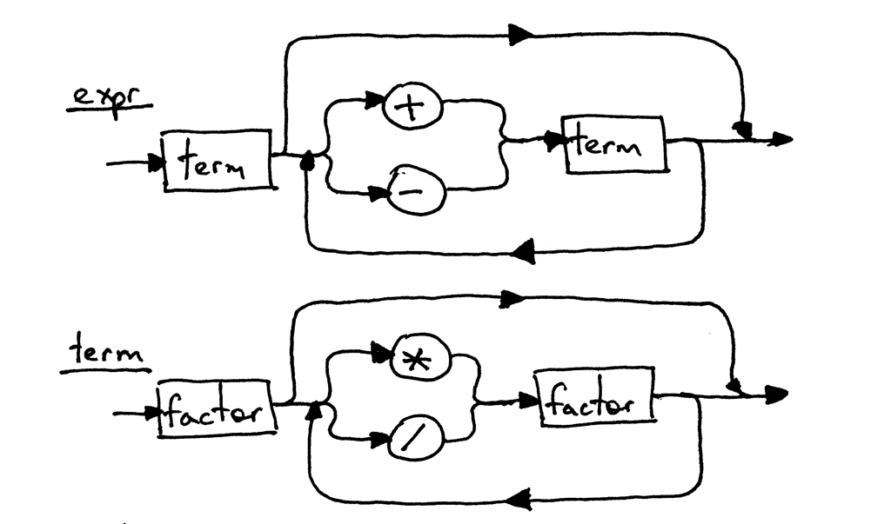
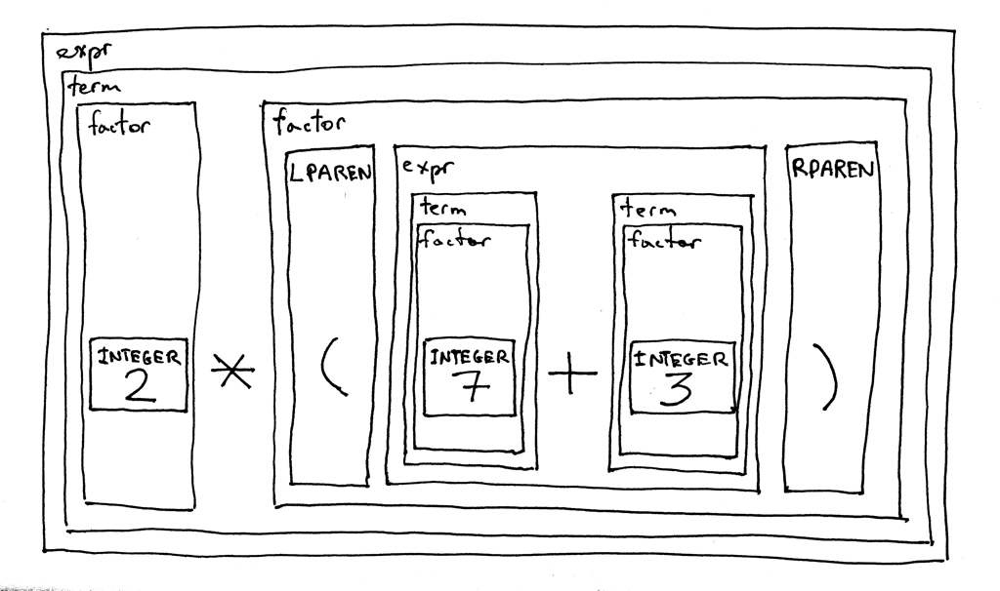

In this article, we're wrapping up our discussion of arithmetic expressions by adding parenthesized expressions to the grammar and implementing an interpreter that will be able to evaluate parenthesized expressions with arbitrarily deep nesting, like `7 + 3 * (10 / (12 / 3 ) + 1 ) -1`.

First, we need to modify the grammar to support expressions inside parentheses. The *factor* rule is used for basic units in expressions. Today, we're adding another basic unit - not just an integer - a parenthesized expression. 

Here is the updated grammar:


The only change is in the *factor* production where the terminal LPAREN represents a left parenthesis *(*, the terminal RPAREN represents a right parenthesis *)*, and the non-terminal *expr* between the parentheses refers to the *expr* rule.

Here is the updated syntax diagram for the *factor*, which now includes alternatives:


The other syntax diagrams stay the same:



Let's decompose the expression `2 * (7 + 3)` according to the grammar and see how it looks:



Here is the code with two main changes:

1. The *Lexer* has been modified to return two more tokens: *LPAREN* for a left parenthesis and *RPAREN* for a right parenthesis.
1. The *Interpreter‘s factor* method has been slightly updated to parse parenthesized expressions in addition to integers.


```python
# Token types
#
# EOF (end-of-file) token is used to indicate that
# there is no more input left for lexical analysis
INTEGER, PLUS, MINUS, MUL, DIV, LPAREN, RPAREN, EOF = (
    'INTEGER', 'PLUS', 'MINUS', 'MUL', 'DIV', '(', ')', 'EOF'
)


class Token(object):
    def __init__(self, type, value):
        self.type = type
        self.value = value

    def __str__(self):
        """String representation of the class instance.

        Examples:
            Token(INTEGER, 3)
            Token(PLUS, '+')
            Token(MUL, '*')
        """
        return 'Token({type}, {value})'.format(
            type=self.type,
            value=repr(self.value)
        )

    def __repr__(self):
        return self.__str__()


class Lexer(object):
    def __init__(self, text):
        # client string input, e.g. "4 + 2 * 3 - 6 / 2"
        self.text = text
        # self.pos is an index into self.text
        self.pos = 0
        self.current_char = self.text[self.pos]

    def error(self):
        raise Exception('Invalid character')

    def advance(self):
        """Advance the `pos` pointer and set the `current_char` variable."""
        self.pos += 1
        if self.pos > len(self.text) - 1:
            self.current_char = None  # Indicates end of input
        else:
            self.current_char = self.text[self.pos]

    def skip_whitespace(self):
        while self.current_char is not None and self.current_char.isspace():
            self.advance()

    def integer(self):
        """Return a (multidigit) integer consumed from the input."""
        result = ''
        while self.current_char is not None and self.current_char.isdigit():
            result += self.current_char
            self.advance()
        return int(result)

    def get_next_token(self):
        """Lexical analyzer (also known as scanner or tokenizer)

        This method is responsible for breaking a sentence
        apart into tokens. One token at a time.
        """
        while self.current_char is not None:

            if self.current_char.isspace():
                self.skip_whitespace()
                continue

            if self.current_char.isdigit():
                return Token(INTEGER, self.integer())

            if self.current_char == '+':
                self.advance()
                return Token(PLUS, '+')

            if self.current_char == '-':
                self.advance()
                return Token(MINUS, '-')

            if self.current_char == '*':
                self.advance()
                return Token(MUL, '*')

            if self.current_char == '/':
                self.advance()
                return Token(DIV, '/')

            if self.current_char == '(':
                self.advance()
                return Token(LPAREN, '(')

            if self.current_char == ')':
                self.advance()
                return Token(RPAREN, ')')

            self.error()

        return Token(EOF, None)


class Interpreter(object):
    def __init__(self, lexer):
        self.lexer = lexer
        # set current token to the first token taken from the input
        self.current_token = self.lexer.get_next_token()

    def error(self):
        raise Exception('Invalid syntax')

    def eat(self, token_type):
        # compare the current token type with the passed token
        # type and if they match then "eat" the current token
        # and assign the next token to the self.current_token,
        # otherwise raise an exception.
        if self.current_token.type == token_type:
            self.current_token = self.lexer.get_next_token()
        else:
            self.error()

    def factor(self):
        """ factor: INTEGER | LPAREN expr RPAREN """
        token = self.current_token
        if token.type == INTEGER:
            self.eat(INTEGER)
            return token.value
        elif token.type == LPAREN:
            self.eat(LPAREN)
            result = self.expr()
            self.eat(RPAREN)
            return result

    def term(self):
        """ term : factor ((MUL | DIV ) factor)* """
        result = self.factor()
        while self.current_token.type in (MUL, DIV):
            token = self.current_token
            if token.type == MUL:
                self.eat(MUL)
                result = result * self.factor()
            elif token.type == DIV:
                self.eat(DIV)
                result = result / self.factor()

        return result

    def expr(self):
        """Arithmetic expression parser / interpreter.

        calc> 7 + 3 * (10 / (12 / (3 + 1) - 1))
        22

        expr   : term ((PLUS | MINUS) term)*
        term   : factor ((MUL | DIV) factor)*
        factor : INTEGER | LPAREN expr RPAREN
        """

        result = self.term()
        while self.current_token.type in (PLUS, MINUS):
            token = self.current_token
            if token.type == PLUS:
                self.eat(PLUS)
                result = result + self.term()
            elif token.type == MINUS:
                self.eat(MINUS)
                result = result - self.term()

        return result

def main():
    while True:
        try:
            text = input('calc>')
        except EOFError:
            break
        if not text:
            continue
        lexer = Lexer(text)
        interpreter = Interpreter(lexer)
        result = interpreter.expr()
        print(result)

if __name__ == '__main__':
    main()
```

[Next on recursive-descent parsers](./part-7.md)
