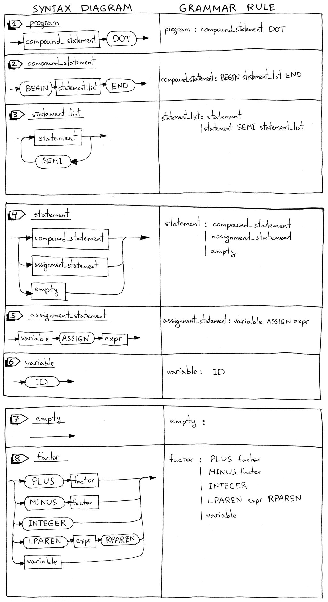
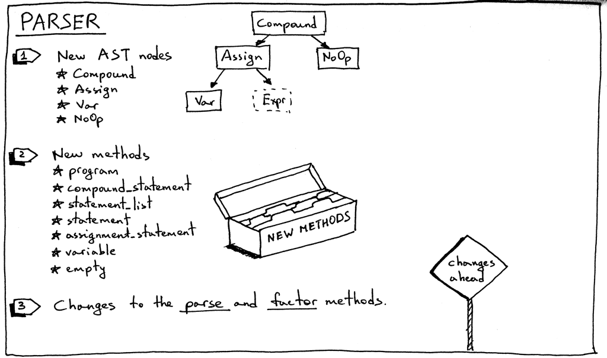
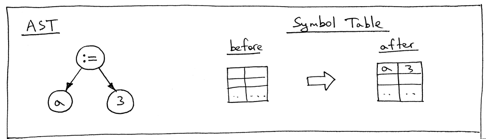
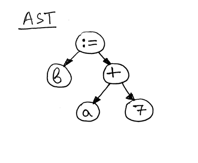
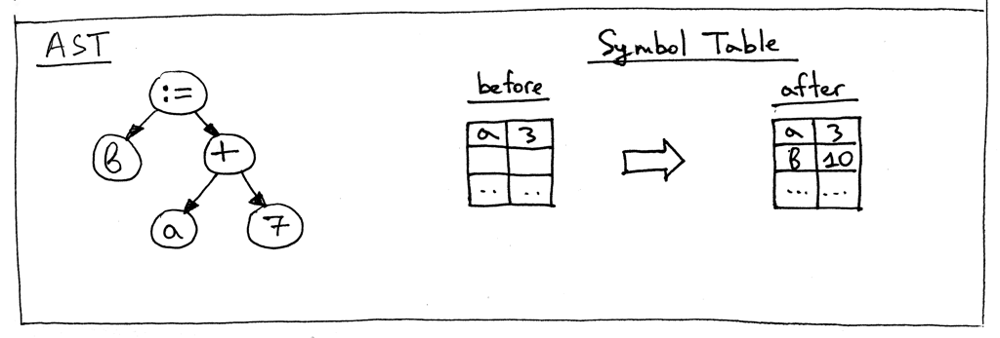

Here is what we're going to go through:

1. How to parse and interpret a Pascal program definiton
1. How to parse and interpret compound statements
1. How to parse and interpret assignment statements, including variables
1. A bit about symbol tables and how to store and lookup variables.

The following sample Pascal-like program to introduce new concepts:

    # Pascal-like
    BEGIN
        BEGIN
            number := 2;
            a := number;
            b := 10 * a + 10 * number / 4;
            c := a - - b
        END;
        x := 11;
    END.


Let's dive in and look at syntax diagrams for new language constructs and their corresponding grammar rules.



1. A Pascal *program* consists of a *compound statement* that ends with a dot. Here is an example of a program (this is not a complete program definition, and we'll extend it later in the series):

        BEGIN END.

1. A *compound statement* is a block marked with `BEGIN` and `END` that can contain a list (possibly empty) of statements including other compound statements. Every statement inside the compound statement, except for the last one, must terminate with a semicolon. The last statement in the block may or may not have a terminating semicolon:

        BEGIN END
        BEGIN a := 5; x := 11 END
        BEGIN a := 5; x := 11; END
        BEGIN BEGIN a := 5 END; x := 11 END

1. A *statement list* is a list of zero or more statements inside a compound statement.

1. A *statement* can be a *compound statement*, an *assignment statement*, or it can be an *empty statement*.

1. An *assignment statement* is a variable followed by an ASSIGN token `:=`, followed by an expression.

        a := 11
        b := a + 9 - 5 * 2

1. A *variable* is an identifier. We use the ID token for variables. The value of the token will be a variable's name like `a`, `number` and so on.

        BEGIN a := 11; b := a + 9; END

1. An *empty statement* represents a grammar rule with no further productions. We use the *empty_statement* grammar rule to indicate the end of the *statement_list* in the parser and also to allow for empty compound statement as in `BEGIN END`.

1. The *factor* rule is updated to handle variables.

Now let's take a looke at our complete grammar:

```
program : compound_statement DOT

compound_statement : BEGIN statement_list END

statement_list : statement
                | statement SEMI statement_list

statement : compound_statement
            | assignment_statement
            | empty

assignment_statement : variable ASSIGN expr

empty :

expr: term ((PLUS | MINUS) term)*

term: factor ((MUL | DIV) factor)*

factor : PLUS factor
        | MINUS factor
        | INTEGER
        | LPAREN expr RPAREN
        | variable

variable: ID
```

You probably noticed that we don't use the star '*' symbol in the *compound_statement* rule to represent zero or more repetitions, but instead explicitly specified the *statement_list* rule. This is another way to represent the 'zero or more' operation, and it will come in handy when we look at parser generators like [PLY](http://www.dabeaz.com/ply/), later in the series. We'll also split the “(PLUS | MINUS) factor” sub-rule into two separate rules.

In order to support the updated grammar, we need to make a number of changes to our lexer, parser, and interpreter. Let's go over those changes one by one.

Here is the summary of the changes in our lexer: 


1. To support a Pascal program's definition, compound statements, assignment statements, and variables, our lexer needs to return new tokens:

    - BEGIN (to mark the beginning of a compound statement)
    - END (to mark the end of the compound statement)
    - DOT (a token for a dot character '.' required by a Pascal program's definition)
    - ASSIGN (a token for a two character sequence ':='). In Pascal, an assignment operator is different than in many other languages like C, Python, Java, Rust, or Go, where you would use single character '=' to indicate assignment
    - SEMI (a token for a semicolon character ';' that is used to mark the end of a statement inside a compound statement)
    - ID (A token for a valid identifier. Identifiers start with an alphabetical character followed by any number of alphanumerical characters)

1. Sometimes, in order to be able to differentiate between different tokens that start with the same character, (':' vs ':=' or '==' vs '=>' ) we need to peek into the input buffer without actually consuming the next character. For this particular purpose, We introduced a *peek* method that will help us tokenize assignment statements. The method is not strictly required, but it will also make the *get_next_token* method a bit cleaner if we introduce it earlier in the series. All it does is return the next character from the text buffer without incrementing the *self.pos* variable. Here is the method itself:

    ```python
    def peek(self):
        peek_pos = self.pos + 1
        if peek_pos > len(self.text) - 1:
            return None
        else:
            return self.text[peek_pos]
    ```

1. Because Pascal variables and reserved keywords are both identifiers, we will combine their handling into one method called *_id*. The way it works is that the lexer consumes a sequence of alphanumerical characters and then checks if the character sequence is a reserved word. If it is, it returns a pre-constructed token for that reserved keyword. And if it's not a reserved keyword, it returns a new ID token whose value is the character string (lexeme).

    ```python
    RESERVED_KEYWORDS = {
        'BEGIN': Token('BEGIN', 'BEGIN'),
        'END': Token('END', 'END'),
    }

    def _id(self):
        """ Handle indentifiers and reserved keywords """
        result = ''
        while self.current_char is not None and self.current_char.isalnum():
            result += self.current_char
            self.advance()

        token = RESERVED_KEYWORDS.get(result, Token(ID, result))
        return token
    ```

1. And now let's take a look at the changes in the main lexer method *get_next_token*:

    ```python
    def get_next_token(self):
        while self.current_char is not None:
            ...
            if self.current_char.isalpha():
                return self._id()

            if self.current_char == ':' and self.peek() == '=':
                self.advance()
                self.advance()
                return Token(ASSIGN, ':=')

            if self.current_char == ';':
                self.advance()
                return Token(SEMI, ';')

            if self.current_char == '.':
                self.advance()
                return Token(DOT, '.')
            ...
    ```

## Appendix

And the complete code:

```python
""" SPI - Simple Pascal Interpreter. Part 9."""

###############################################################################
#                                                                             #
#  LEXER                                                                      #
#                                                                             #
###############################################################################

# Token types
#
# EOF (end-of-file) token is used to indicate that
# there is no more input left for lexical analysis

(INTEGER, PLUS, MINUS, MUL, DIV, LPAREN, RPAREN, ID, ASSIGN,
 BEGIN, END, SEMI, DOT, EOF) = (
    'INTEGER', 'PLUS', 'MINUS', 'MUL', 'DIV', '(', ')', 'ID', 'ASSIGN',
    'BEGIN', 'END', 'SEMI', 'DOT', 'EOF'
)


class Token(object):
    def __init__(self, type, value):
        self.type = type
        self.value = value

    def __str__(self):
        """String representation of the class instance.
        Examples:
            Token(INTEGER, 3)
            Token(PLUS, '+')
            Token(MUL, '*')
        """
        return 'Token({type}, {value})'.format(
            type=self.type,
            value=repr(self.value)
        )

    def __repr__(self):
        return self.__str__()


RESERVED_KEYWORDS = {
    'BEGIN': Token('BEGIN', 'BEGIN'),
    'END': Token('END', 'END'),
}


class Lexer(object):
    def __init__(self, text):
        # client string input, e.g. "4 + 2 * 3 - 6 / 2"
        self.text = text
        # self.pos is an index into self.text
        self.pos = 0
        self.current_char = self.text[self.pos]

    def error(self):
        raise Exception('Invalid character')

    def advance(self):
        """Advance the `pos` pointer and set the `current_char` variable."""
        self.pos += 1
        if self.pos > len(self.text) - 1:
            self.current_char = None  # Indicates end of input
        else:
            self.current_char = self.text[self.pos]

    def peek(self):
        peek_pos = self.pos + 1
        if peek_pos > len(self.text) - 1:
            return None
        else:
            return self.text[peek_pos]

    def skip_whitespace(self):
        while self.current_char is not None and self.current_char.isspace():
            self.advance()

    def integer(self):
        """Return a (multidigit) integer consumed from the input."""
        result = ''
        while self.current_char is not None and self.current_char.isdigit():
            result += self.current_char
            self.advance()
        return int(result)

    def _id(self):
        """Handle identifiers and reserved keywords"""
        result = ''
        while self.current_char is not None and self.current_char.isalnum():
            result += self.current_char
            self.advance()

        token = RESERVED_KEYWORDS.get(result, Token(ID, result))
        return token

    def get_next_token(self):
        """Lexical analyzer (also known as scanner or tokenizer)
        This method is responsible for breaking a sentence
        apart into tokens. One token at a time.
        """
        while self.current_char is not None:

            if self.current_char.isspace():
                self.skip_whitespace()
                continue

            if self.current_char.isalpha():
                return self._id()

            if self.current_char.isdigit():
                return Token(INTEGER, self.integer())

            if self.current_char == ':' and self.peek() == '=':
                self.advance()
                self.advance()
                return Token(ASSIGN, ':=')

            if self.current_char == ';':
                self.advance()
                return Token(SEMI, ';')

            if self.current_char == '+':
                self.advance()
                return Token(PLUS, '+')

            if self.current_char == '-':
                self.advance()
                return Token(MINUS, '-')

            if self.current_char == '*':
                self.advance()
                return Token(MUL, '*')

            if self.current_char == '/':
                self.advance()
                return Token(DIV, '/')

            if self.current_char == '(':
                self.advance()
                return Token(LPAREN, '(')

            if self.current_char == ')':
                self.advance()
                return Token(RPAREN, ')')

            if self.current_char == '.':
                self.advance()
                return Token(DOT, '.')

            self.error()

        return Token(EOF, None)


###############################################################################
#                                                                             #
#  PARSER                                                                     #
#                                                                             #
###############################################################################

class AST(object):
    pass


class BinOp(AST):
    def __init__(self, left, op, right):
        self.left = left
        self.token = self.op = op
        self.right = right


class Num(AST):
    def __init__(self, token):
        self.token = token
        self.value = token.value


class UnaryOp(AST):
    def __init__(self, op, expr):
        self.token = self.op = op
        self.expr = expr


class Compound(AST):
    def __init__(self):
        self.children = []


class Assign(AST):
    def __init__(self, left, op, right):
        self.left = left
        self.token = self.op = op
        self.right = right


class Var(AST):
    """ The Var node is constructed out of ID token. """

    def __init__(self, token):
        self.token = token
        self.value = token.value


class NoOp(AST):
    pass


class Parser(object):
    def __init__(self, lexer):
        self.lexer = lexer
        # set current token to the first token taken from the input
        self.current_token = self.lexer.get_next_token()

    def error(self):
        raise Exception('Invalid syntax')

    def eat(self, token_type):
        # compare the current token type with the passed token
        # type and if they match then "eat" the current token
        # and assign the next token to the self.current_token,
        # otherwise raise an exception.
        if self.current_token.type == token_type:
            self.current_token = self.lexer.get_next_token()
        else:
            self.error()

    def program(self):
        """ program : compound_statement DOT """
        node = self.compound_statement()
        self.eat(DOT)
        return node

    def compound_statement(self):
        """
        compound_statement: BEGIN statement_list END
        """
        self.eat(BEGIN)
        nodes = self.statement_list()
        self.eat(END)

        root = Compound()
        for node in nodes:
            root.children.append(node)

        return root

    def statement_list(self):
        """
        statement_list : statement
                       | statement SEMI statement_list
        """
        node = self.statement()

        results = [node]

        while self.current_token.type == SEMI:
            self.eat(SEMI)
            results.append(self.statement())

        if self.current_token.type == ID:
            self.error()

        return results

    def statement(self):
        """
        statement : compound_statement
            | assignment_statement
            | empty
        """
        if self.current_token.type == BEGIN:
            node = self.compound_statement()
        elif self.current_token.type == ID:
            node = self.assignment_statement()
        else:
            node = self.empty()

        return node

    def assignment_statement(self):
        """
        assignment_statement: variable ASSIGN expr
        """
        left = self.variable()
        token = self.current_token
        self.eat(ASSIGN)
        right = self.expr()
        node = Assign(left, token, right)
        return node

    def variable(self):
        """
        variable : ID
        """
        node = Var(self.current_token)
        self.eat(ID)
        return node

    def empty(self):
        """ An empty production"""
        return NoOp()

    def expr(self):
        """
        expr : term ((PLUS | MINUS))*
        """

        node = self.term()
        while self.current_token.type in (PLUS, MINUS):
            token = self.current_token
            if token.type == PLUS:
                self.eat(PLUS)
            elif token.type == MINUS:
                self.eat(MINUS)

            node = BinOp(left=node, op=token, right=self.term())
        return node

    def term(self):
        """ term : factor ((MUL | DIV) factor)* """
        node = self.factor()

        while self.current_token.type in (MUL, DIV):
            token = self.current_token
            if token.type == MUL:
                self.eat(MUL)
            elif token.type == DIV:
                self.eat(DIV)

            node = BinOp(left=node, op=token, right=self.factor())

        return node

    def factor(self):
        """ factor : PLUS factor
                   | MINUS factor
                   | INTEGER
                   | LPAREN expr RPAREN
                   | variable
        """
        token = self.current_token
        if token.type == PLUS:
            self.eat(PLUS)
            node = UnaryOp(token, self.factor())
            return node
        elif token.type == MINUS:
            self.eat(MINUS)
            node = UnaryOp(token, self.factor())
            return node
        elif token.type == INTEGER:
            self.eat(INTEGER)
            return Num(token)
        elif token.type == LPAREN:
            self.eat(LPAREN)
            node = self.expr()
            self.eat(RPAREN)
            return node
        else:
            node = self.variable()
            return node

    def parse(self):
        """
        program : compound_statement DOT
        compound_statement : BEGIN statement_list END
        statement_list : statement
                       | statement SEMI statement_list
        statement : compound_statement
                  | assignment_statement
                  | empty
        assignment_statement : variable ASSIGN expr
        empty :
        expr: term ((PLUS | MINUS) term)*
        term: factor ((MUL | DIV) factor)*
        factor : PLUS factor
               | MINUS factor
               | INTEGER
               | LPAREN expr RPAREN
               | variable
        variable: ID
        """
        node = self.program()
        if self.current_token.type != EOF:
            self.error()

        return node


###############################################################################
#                                                                             #
#  INTERPRETER                                                                #
#                                                                             #
###############################################################################


class NodeVisitor(object):
    def visit(self, node):
        method_name = 'visit_' + type(node).__name__
        visitor = getattr(self, method_name, self.generic_visit)
        return visitor(node)

    def generic_visit(self, node):
        raise Exception('No visit_{} method'.format(type(node).__name__))


class Interpreter(NodeVisitor):
    GLOBAL_SCOPE = {}

    def __init__(self, parser):
        self.parser = parser

    def visit_BinOp(self, node):
        if node.op.type == PLUS:
            return self.visit(node.left) + self.visit(node.right)
        elif node.op.type == MINUS:
            return self.visit(node.left) - self.visit(node.right)
        elif node.op.type == MUL:
            return self.visit(node.left) * self.visit(node.right)
        elif node.op.type == DIV:
            return self.visit(node.left) / self.visit(node.right)

    def visit_Num(self, node):
        return node.value


    def visit_UnaryOp(self, node):
        op = node.op.type
        if op == PLUS:
            return +self.visit(node.expr)
        elif op == MINUS:
            return -self.visit(node.expr)

    def visit_Compound(self, node):
        for child in node.children:
            self.visit(child)

    def visit_Assign(self, node):
        var_name = node.left.value
        self.GLOBAL_SCOPE[var_name] = self.visit(node.right)

    def visit_Var(self, node):
        var_name = node.value
        val = self.GLOBAL_SCOPE.get(var_name)
        if val is None:
            raise NameError(repr(var_name))
        else:
            return val

    def visit_NoOp(self, node):
        pass

    def interpret(self):
        tree = self.parser.parse()
        if tree is None:
            return ''
        return self.visit(tree)

def main():
    import sys
    text = open(sys.argv[1], 'r').read()

    lexer = Lexer(text)
    parser = Parser(lexer)
    interpreter = Interpreter(parser)
    result = interpreter.interpret()
    print(interpreter.GLOBAL_SCOPE)


if __name__ == '__main__':
    main()
```

Moving on to parser changes.

Here is the summary of changes in the parser:



1.Let's start with new AST nodes:

- Compound AST node represents a compound statement. It contains a list of statement nodes in its `children` variable.

```python
class Compound(AST):
    """ Represents a 'BEGIN ... END' block """
    def __init__self():
        self.children = []
```

- Assign AST node represents an assignemnt statement. Its `left` variable is for storing a *Var* node and its `right` variable for a node returned by the *expr* parser method:

```python
class Assign(AST):
    def __init__(self, left, op , right):
        self.left = left
        self.token = self.op = op
        self.right = right
```

- *NoOp* node is used to represent an empty statement. For example `BEGIN END` is a valid compound statement that has no statements.

```python
class NoOp(AST):
    pass
```
    
2.Each rule from the grammar has a corresponding method in the recursive-descent parser. This time we add some methods which are responsible for parsing new language constructs and constructing new AST nodes. They are pretty straightforward:

```python
def program(self):
    """ program : compound_statement DOT """
    node = self.coumpound_statement()
    self.eat(DOT)
    return node

def compound_statement(self):
    """
    compound_statement: BEGIN statement_list END
    """
    self.eat(BEGIN)
    nodes = self.statement_list()
    self.eat(END)

    root = Compound()
    for node in nodes:
        root.children.append(node)
    
    return root

def statement_list(self):
    """
    statement_list : statement
                   | statement SEMI statement_list
    """
    node = self.statement()

    results = [node]

    while self.current_token.type == SEMI:
        self.eat(SEMI)
        results.append(self.statement())

    if self.current_token.type == ID:
        self.error()

    return results

def statement(self):
    """
    statement : compound_statement
              | assignment_statement
              | empty
    """
    if self.current_token.type == BEGIN:
        node = self.compound_statement()
    elif self.current_token.type == ID:
        node = self.assignment_statement()
    else:
        node = self.empty()
    
    return node

def assign_statement(self):
    """
    assignment_statement : variable ASSIGN expr
    """
    left = self.variable()
    token = self.current_token
    self.eat(ASSIGN)
    right = self.expr()
    node = Assign(left, token, right)
    return node

def variable(self):
    """
    variable: ID
    """
    node = Var(self.current_token)
    self.eat(ID)
    return node

def empty(self):
    """ An empty production """
    return NoOp()
```

3.We also need to update the existing *factor* method to parse variables:

```python
def factor(self):
    """
    factor : PLUS factor
           | MINUS factor
           | INTEGER
           | LPAREN expr RPAREN
           | variable
    """
    token = self.current_token
    if token.type == PLUS:
        self.eat(PLUS)
        node = UnaryOp(token, self.factor())
        return node
    ...
    else:
        node = self.variable()
        return node
```

4.The parser's *parse* method is updated to start the parsing process by parsing a program definition;

```python
def parse(self):
    node = self.program()
    if self.current_token.type != EOF:
        self.error()
    
    return node
```

And some changes are required for the interpreter:


To interpreter new AST nodes, we need to add corresponding visitor methods to the interpreter. 

- visit_Compound
- visit_Assign
- visit_Var
- visit_NoOp

*Compound* and *NoOp* visitor methods are pretty straightforward. The *visit_Compound* method iterates over its children and visits each one in turn, and the *visit_NoOp* method does nothing.

```python
def visit_Compound(self, node):
    for child in node.children:
        self.visit(child)

def visit_NoOp(self, node):
    pass
```

The *Assign* and *Var* visitor methods deserve a closer examination.

When we assign a value to a variable, we need to store that value somewhere for when we need it later, and that's exactly what the *visit_Assign* method does:

```python
def visit_Assign(self, node):
    var_name = node.left.value
    self.GLOBAL_SCOPE[var_name] = self.visit(node.right)
```

The method stores a key-value pair in a *symbol table* GLOBAL_SCOPE, which is an abstract data type (ADT) for tracking various symbols in source code. The only symbol category we have right now is variables and we use the Python dictionary to implement the symbol table ADT.

Let's take a look at an AST for the statement "a := 3;" and the symbol table before and after the *visit_Assign* method does its job:



Then take a look at an AST for the statement "b := a + 7;"



The right-hand side of the assignment statement - "a + 7" -references the variable 'a', so we need to find out what the value 'a' is before we can evaluate the expression "a + 7", which is the responsibility of the *visit_Var* method:

```python
def visit_Var(self,node):
    var_name = node.value
    val = self.GLOBAL_SCOPE.get(var_name)
    if val is None:
        raise NameError(repr(var_name))
    else:
        return val
```

When the method visits a *Var* node as in the above AST picture, it first gets the variable's name and then uses that name as a key into the `GLOBAL_SCOPE` dictionary to get the variable's value. If it can find the value, it returns it, if not - it raises a *NameError* exception. Here are the contents of the symbol table before evaluating the assignment statement "b := a + 7;": 



# Wrapping Up

In this article we introduce a number of "hacks" which will be removed as we move forward with the series:

1. The program grammar rule is incomplete. We'll extend it later with additional elements.
1. Pascal is a statically typed language, and you must declare a variable and its type before using it. But, as you saw, that was not the case in this article.
1. No type checking so far. It's not a big deal at this point, but I just wanted to mention it explicitly. Once we add more types to our interpreter we'll need to report an error when you try to add a string and an integer, for example.
1. A symbol table in this part is a simple Python dictionary that does double duty as a memory space. Worry not: symbol tables are such an important topic that I'll have several articles dedicated just to them. And memory space (runtime management) is a topic of its own.
1. In our simple calculator from previous articles, we used a forward slash character '/' for denoting integer division. In Pascal, though, you have to use a keyword div to specify integer division.
1. There is also one hack that I introduced on purpose in Pascal all reserved keywords and identifiers are case insensitive, but the interpreter in this article treats them as case sensitive.


[Next, close the gap](./part-10.md)
